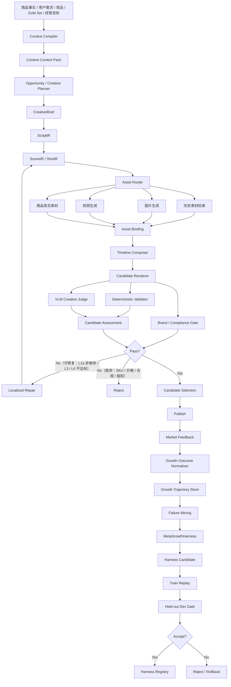
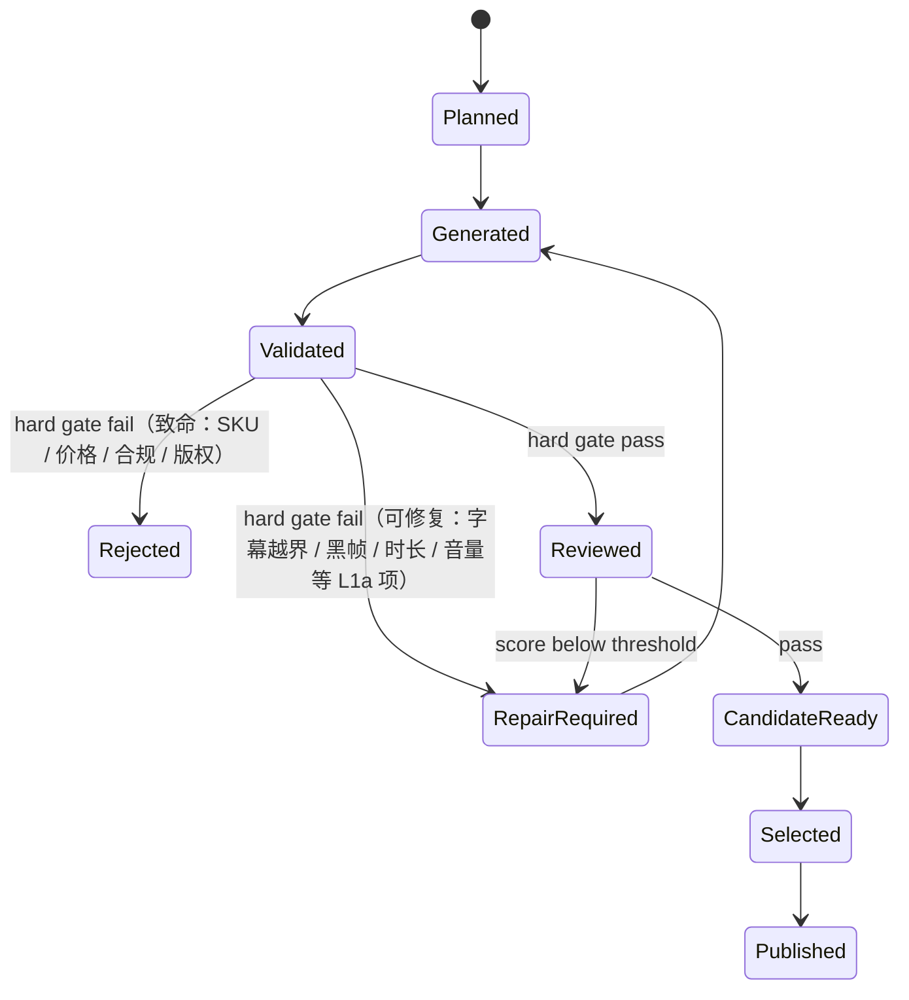
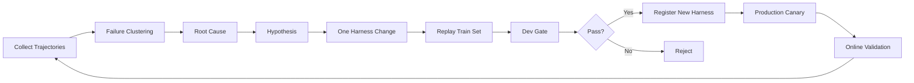

# AutoDesign Meta-Harness 在 OpenMontage 电商视频生成链路中的落地技术方案

> 版本：v1.1（OpenMontage 架构适配版）  
> 目标：将 AutoDesign 的“可编辑 Artifact + Inner Loop + Evaluator + Held-out Gate + Meta-Harness”思想，落地到 OpenMontage 现有的 instruction-driven（agent-first）视频生产系统，形成可执行、可评测、可追溯、可持续自我优化的内容增长工厂。
>
> v1.1 变更：按 OpenMontage 现有架构（`pipeline_defs/` + `skills/` + `schemas/` + `BaseTool` + checkpoint + cost_tracker）重写落地方式；明确在线增长闭环（Phase 4-5）的部署前提；修正 v1.0 内部矛盾（8 层未定义完整、hard gate 可修复性、Test Set 未进入 gate、Persuasion 公式与维度不一致、L5/L6 指标重复、合规 judge 定位、judge 版本治理、publish 人工审批等）。详见 §45 修订记录。

---

## 0. 文档摘要

传统 AI 视频生成系统通常关注：

```text
输入商品信息
→ 写脚本
→ 调视频模型
→ 合成
→ 输出 MP4
```

这个模式解决的是“能不能生成”，但没有解决三个更重要的问题：

1. 为什么这条视频好 / 不好？
2. 哪个环节导致失败？
3. 做完 1000 条以后，系统是否会比第 1 条更聪明？

本方案将视频生成系统升级为：

```text
商品 / 用户需求 / 爆款样本 / 经营目标
                ↓
        Content Context Pack
                ↓
           Creative Planner
                ↓
 CreativeBrief → ScriptIR → ShotIR
                ↓
   Asset Retrieval / Generation
                ↓
            Compose
                ↓
      Candidate A / B / C
                ↓
         GrowthBench
                ↓
       Localized Repair
                ↓
            Publish
                ↓
CTR / Retention / CVR / GMV / ROI
                ↓
        Growth Trajectory
                ↓
        MetaGrowthHarness
                ↓
      Better Production System
```

核心目标不是“把一条视频改到最好”，而是：

> **让每一轮生成、审核、人工修改、上线实验，都能持续升级视频生产系统本身。**

---

# 1. 建设目标

## 1.1 总目标

构建一套面向电商短视频的 **Self-Improving Content Growth Harness**，使视频生产具备以下能力：

- 输入可结构化；
- 中间过程可编辑；
- 每个镜头可解释、可追溯；
- 生成失败可以局部修复；
- 一次生成多个 Candidate，并自动比较；
- 离线质量与线上经营效果统一评估；
- 人工修改可以沉淀为系统经验；
- 线上表现可以反哺策略；
- 系统优化必须经过 Train / Dev / Test Gate；
- Harness 的修改可版本化、可回滚。

---

## 1.2 不解决什么

本方案不试图：

- 自研底层视频生成大模型；
- 用一个超长 Prompt 解决所有任务；
- 让单个 Agent 负责从洞察到视频到经营复盘的全部工作；
- 将“VLM 打高分”直接等价成“爆款”；
- 用 Raw GMV 直接作为内容质量 Reward；
- 每次视频有问题就整条重新生成；
- 把 OpenMontage 的 instruction-driven（agent-first）架构改造成服务端微服务 / 中心化编排架构；
- 在开源仓库内实现依赖真实平台广告数据的在线自进化闭环（该能力属于商业部署形态，见 §37）。

## 1.3 与 OpenMontage 架构的适配总纲

OpenMontage 是 instruction-driven（agent-first）系统：编排、创意决策、评审、阶段流转都由 agent 按 pipeline manifest（YAML）+ stage director skill（MD）执行；Python 只提供工具（`tools/base_tool.py` 的 ToolContract）与持久化；不存在 Python orchestrator、HTTP server 或关系数据库。现有持久化事实包括：`schemas/artifacts/`（brief / script / scene_plan / asset_manifest / edit_decisions / render_report / publish_log / review 等）、checkpoint、`tools/cost_tracker.py`（estimate → reserve → reconcile）、`skills/meta/reviewer.md`（max 2 rounds）。

本文档所有设计按以下 5 条原则落到 OpenMontage：

1. **逻辑概念落文件，不引入服务端 / 数据库**：Run / Attempt / Candidate / Evaluation 等全部映射为 JSON artifact + checkpoint；API 一律改为 CLI 命令或 agent 直接读写的文件（§34）。
2. **复用现有 artifact，不建平行体系**：CreativeBrief 等新 IR 与现有 brief / script / scene_plan / asset_manifest / edit_decisions 建立映射与引用关系，而不是另起炉灶。
3. **评测挂载到现有 gate / review 机制**：GrowthBench 落地为 `docs/stage-gates/` 检查清单 + reviewer meta skill + 确定性校验工具（继承 BaseTool）。
4. **Inner Loop 复用 checkpoint 与 cost_tracker**：修复、重试、预算与人工审批全部走现有机制，不新造审批系统。
5. **Meta-Harness 以文件化 registry + skill 实现**；在线数据闭环（L5 / L6、A/B、canary）属于商业部署前提，开源仓库只做接口预留与模拟回放（§37）。

概念映射表：

| 本文档概念 | OpenMontage 落地载体 |
|---|---|
| CreativeBrief | `schemas/artifacts/brief.schema.json`（扩展） |
| ScriptIR | `schemas/artifacts/script.schema.json`（扩展）+ 新增 `script_ir` 派生视图 |
| ShotIR | `schemas/artifacts/scene_plan.schema.json`（镜头级扩展） |
| AssetBinding | `asset_manifest.schema.json` + `asset_plan.schema.json` |
| TimelineIR | `edit_decisions.schema.json` |
| RenderArtifact | `render_report.schema.json` |
| Run / Attempt / Candidate / Trace | `schemas/events/run_event.schema.json`（扩展）+ checkpoint |
| Candidate Assessment / Review | `review.schema.json` + `final_review.schema.json` |
| Publish | `publish_log.schema.json` |
| Attempt Budget | `tools/cost_tracker.py` + pipeline manifest 预算字段 |
| 人工审批 | checkpoint 协议 + per-stage `human_approval_default` |
| GrowthBench L1–L4 | `docs/stage-gates/` + `skills/meta/growthbench.md` |
| Meta-Harness 外循环 | `skills/meta/meta-harness.md` + `meta_harness/` 文件 registry |

统一约定：所有新 artifact 遵循现有 `schemas/artifacts/` 惯例，带 `id / version / created_at / schema_version`；所有新工具继承 `tools/base_tool.py` 的 ToolContract，复杂 I/O 在 `schemas/tools/` 提供 schema，契约测试放 `tests/contracts/`。

---

# 2. 第一性架构原则

整个系统遵循 8 条原则。

## 原则 1：Artifact 必须结构化，而不是只生成 MP4

MP4 是最终交付物，不是系统内部的“源文件”。

系统内部必须维护：

```text
CreativeBrief
→ ScriptIR
→ SceneIR
→ ShotIR
→ AssetBinding
→ GenerationSpec
→ TimelineIR
→ RenderArtifact
```

只有结构化以后，才能做到：

- 局部修改；
- 素材替换；
- 镜头重排；
- Prompt 重编译；
- 失败定位；
- 版本对比；
- 自动评测；
- Trace 回放。

---

## 原则 2：素材优先，生成兜底

对于一个 Shot，不直接进入视频模型。

应该先：

```text
Shot Requirement
      ↓
Asset Retrieval
      ↓
Semantic / Visual Match
      ↓
Match Score ≥ Threshold ?
      ↓
YES                NO
↓                  ↓
复用素材           调视频生成模型
      \            /
       ↓          ↓
        Timeline Compose
```

原因：

- 成本低；
- 真实商品一致性更好；
- SKU 不容易生成错误；
- 企业历史素材可以持续复用；
- 视频模型只处理“素材库无法覆盖”的部分。

---

## 原则 3：Generator 与 Evaluator 分离

生成 Agent 不应该自己决定自己是否合格。

建议：

```text
Planner Model
Generator Model
Evaluator / VLM Judge
Rule Validator
Market Evaluator
```

至少逻辑上分离。

高风险任务可以进一步使用不同模型家族，降低 self-bias。

---

## 原则 4：优先 Localized Repair，不整条重生成

例如评测发现：

```text
Shot 01：Hook 不清楚
Shot 03：商品证明不足
Shot 06：字幕过密
```

系统应该执行：

```text
repair shot_01
replace asset in shot_03
rewrite overlay in shot_06
```

而不是：

```text
regenerate whole video
```

---

## 原则 5：所有优化必须有 Attempt Budget

例如：

```yaml
candidate_limit: 5
repair_limit_per_candidate: 3
max_video_generation_calls: 8
max_cost_per_video: 30
max_wall_clock_minutes: 20
```

避免 Agent 无限反思、无限生成。

---

## 原则 6：Offline Judge 负责筛选，不负责定义爆款

离线评价用于：

- 淘汰明显错误；
- 判断内容结构；
- 判断视觉质量；
- 判断商品事实；
- 判断表达完整度。

真正的“增长有效性”必须来自：

```text
在线实验
+
归因
+
Uplift
+
经营数据
```

---

## 原则 7：Meta-Harness 优化一次只改一个主要变量

例如一轮只修改：

- Hook 规划规则；
- Asset Routing；
- Shot Planner；
- Judge Rubric；
- Candidate Selection；
- Prompt Compiler；
- Context Retrieval；

其中一个。

否则无法做 credit assignment。

---

## 原则 8：Harness 的升级必须经过 Held-out Gate

建议最低要求：

```text
Train Score ↑
Dev Score   ≥ baseline
Critical Gate 不恶化
Cost 不超过上限
```

满足后才能进入生产。

Test Set 保持长期隔离，用于版本验收。

---

# 3. 总体技术架构



---

# 4. 系统分层

建议拆成 8 层：

```text
Layer 1：Data & Evidence Layer（真实世界事实）         — 本节
Layer 2：Context & Memory Layer（ContentContextPack） — 本节
Layer 3：Creative Planning Layer                     — §5
Layer 4：Content IR Layer                            — §6
Layer 5：Asset Intelligence Layer                    — §7
Layer 6：Generation Runtime Layer                    — §8
Layer 7：Evaluation Layer（GrowthBench）             — §11–§17
Layer 8：Evolution Layer（MetaGrowthHarness）        — §23
```

各层在 OpenMontage 中的落点见 §1.3 映射表；Layer 7 / 8 的任务化见 §42。

## Layer 1：Data & Evidence Layer

负责真实世界事实。

包括：

- 商品事实；
- 商品属性；
- SKU；
- 卖点证据；
- 检测报告；
- 价格；
- 库存；
- 历史素材；
- 爆款视频；
- 竞品视频；
- 需求词；
- 搜索趋势；
- 平台数据；
- 历史投放；
- 历史内容实验；
- 人工评价。

输出：

```text
Evidence
ProductFact
DemandEvidence
CompetitorEvidence
CreativeReference
HistoricalOutcome
```

---

## Layer 2：Context & Memory Layer

不是简单 RAG，而是针对当前视频任务编译一个最小充分上下文。

输出对象：

```text
ContentContextPack
```

包含：

```yaml
task:
  platform: douyin
  objective: acquisition
  target_metric: ctr
  target_duration: 15

product:
  sku_id: SKU_001
  category: towel
  facts:
    - fact_id: PF_01
      claim: 高吸水
      evidence_id: EV_92

audience:
  segment: 家庭用户
  state: pain_aware
  scenario: 洗澡后

creative_constraints:
  brand_tone: clean
  forbidden_claims: []
  must_show_product_before_sec: 2

references:
  goldset_ids: [G12, G18, G33]

history:
  winning_patterns:
    - pain_first
    - squeeze_demo
```

Context Pack 应该版本化并保留 hash。

---

# 5. Creative Planning Layer

Planner 的职责不是直接写文案，而是做“内容决策”。

建议拆成：

```text
Opportunity Planner
→ Creative Strategy
→ Hook Planner
→ Script Planner
→ Shot Planner
```

---

## 5.1 CreativeBrief

建议 Schema：

```yaml
creative_brief_id: CB_20260819_001

goal:
  objective: ctr
  secondary_objective: cvr

audience:
  segment: pain_aware
  use_case: shower

core_need:
  problem: 普通毛巾吸水慢

core_claim:
  claim_id: PF_01
  expression: 快速吸水

proof:
  type: demonstration
  mechanism: squeeze_demo

hook:
  pattern: problem_first
  hypothesis: 洗完澡毛巾越擦越湿

story:
  - hook
  - problem
  - demo
  - proof
  - payoff
  - cta

constraints:
  duration: 15
  product_presence_sec: 1.5
```

---

# 6. Content IR 设计

这是整个工程的核心。

---

## 6.1 ScriptIR

```yaml
script_id: SCRIPT_001
duration_target: 15

beats:
  - beat_id: B1
    type: hook
    start: 0
    end: 2
    narration: 洗完澡，毛巾越擦越湿？
    purpose: stop_scroll

  - beat_id: B2
    type: proof
    start: 2
    end: 6
    narration: 看它一压，水直接被吸进去
    claim_ref: PF_01
```

---

## 6.2 ShotIR

```yaml
shot_id: SHOT_03
beat_id: B2

duration:
  target: 1.8

purpose:
  primary: proof
  secondary: product_focus

visual:
  subject: towel
  action: squeeze
  scene: bathroom
  camera:
    shot_size: macro
    movement: static
    angle: top_down

product:
  sku_id: SKU_001
  visibility_required: true

claim:
  claim_ref: PF_01

asset_requirement:
  media_type: video
  real_product_required: true
  retrieval_first: true

generation_fallback:
  model_capability:
    - realistic_product
    - hand_interaction

text_overlay:
  text: 吸水真的快
  max_chars: 8
```

---

## 6.3 AssetBinding

```yaml
binding_id: AB_1903
shot_id: SHOT_03

source:
  type: historical_asset
  asset_id: ASSET_9231

match:
  semantic_score: 0.91
  visual_score: 0.88
  sku_match: true

transform:
  crop: 9:16
  speed: 1.0            # 默认不变速；确需变速时必须记录理由，并校验与口播/动作同步不冲突
  trim:
    start: 1.2
    end: 3.0

fallback:
  generation_spec_id: GEN_882
```

---

## 6.4 TimelineIR

```yaml
timeline_id: TL_001
fps: 30
resolution: 1080x1920

tracks:
  video:
    - shot_id: SHOT_01
      start: 0
      end: 1.6
    - shot_id: SHOT_02
      start: 1.6
      end: 3.5

  captions:
    - text: 洗完澡毛巾越擦越湿？
      start: 0.1
      end: 1.5

  audio:
    narration_id: VO_01
    bgm_id: BGM_12
```

> 时间轴以真实配音时长为准：TTS 实测时长驱动 caption / audio 轨重排。IR 中的 start / end 是规划值，最终以实测配音与素材真实时长收窄后的精确裁点为准。

---

# 7. Asset Intelligence Layer

Asset Router 是企业内容工厂的重要壁垒。

## 7.1 检索顺序

建议：

```text
1. 同 SKU 历史真实视频
2. 同 SKU 图片
3. 同品类可复用素材
4. Gold Set 中可迁移的非商品镜头
5. 生成
```

---

## 7.2 Asset Match Score

建议：

\[
Score =
w_1 S_{semantic}
+w_2 S_{visual}
+w_3 S_{sku}
+w_4 S_{action}
+w_5 S_{scene}
+w_6 S_{quality}
-w_7 Risk
\]

其中：

```text
sku_match = hard priority
action_match = 是否满足动作
scene_match = 场景
visual = 视觉一致性
semantic = 语义
quality = 清晰度 / 构图 / 可编辑性
risk = 版权 / 商品错误 / 过时信息
```

---

## 7.3 Routing Rule 示例

```python
if real_product_required and exact_sku_asset_exists:
    use_existing_asset()

elif best_asset_score >= 0.85:
    reuse_and_transform()

elif image_asset_score >= 0.80:
    image_to_video()

else:
    text_to_video()
```

---

# 8. Generation Runtime

Generation Runtime 不应该绑定单一模型。

抽象接口：

```python
generate_video(
    shot_ir,
    product_refs,
    style_refs,
    generation_constraints,
    budget
) -> GeneratedAsset
```

Model Router 根据：

- 商品真实性；
- 人物；
- 运镜；
- 图生视频；
- 文生视频；
- 时长；
- 成本；
- latency；
- 历史成功率；

进行路由。

---

## 8.1 Model Capability Registry

```yaml
model_id: video_model_A

capabilities:
  text_to_video: true
  image_to_video: true
  product_consistency: 0.82
  human_motion: 0.91
  typography: 0.20

cost:
  per_second: 0.6

historical:
  success_rate:
    ecommerce_product: 0.76
    hand_interaction: 0.58
```

---

# 9. Candidate / Attempt 基础设施

建议将一次视频生产任务建模为：

```text
Run
 ├── Attempt 1
 │    ├── Candidate A
 │    └── Candidate B
 ├── Attempt 2
 │    └── Candidate C
```

---

## 9.1 Run

一次完整业务任务。

```yaml
run_id: RUN_001
task_id: TASK_932
harness_version: H_1.7.3
context_hash: xxx
```

---

## 9.2 Attempt

一次策略执行。

```yaml
attempt_id: ATT_01
run_id: RUN_001

strategy:
  hook_pattern: pain_first
  asset_policy: retrieval_first

budget:
  cost: 18.3
  generation_calls: 4
```

---

## 9.3 Candidate

一个可评估成片。

```yaml
candidate_id: CAN_01
attempt_id: ATT_01

artifact:
  video_uri: ...
  timeline_uri: ...

evaluation_status: completed
```

---

# 10. Inner Loop：单条视频优化闭环

状态机：



> 与 §3 架构图一致的约定：hard gate 失败分为可修复（L1a 非致命项，进入有界 Repair）与致命（SKU / 价格 / 合规 / 版权，直接 Reject）；§12 的 L1a / L1b 拆分与之对应。

---

## 10.1 Localized Repair 类型

建议支持：

```text
REWRITE_HOOK
REWRITE_NARRATION
REPLACE_ASSET
REGENERATE_SHOT
REORDER_SHOTS
SHORTEN_SHOT
ADD_PRODUCT_CLOSEUP
ADD_PROOF
EDIT_CAPTION
CHANGE_AUDIO
CHANGE_CTA
```

---

## 10.2 Repair Planner 输入

```yaml
failure:
  dimension: proof_strength
  score: 2
  shot_id: SHOT_03
  evidence: 商品卖点只是口播，没有视觉证明

allowed_actions:
  - replace_asset
  - regenerate_shot
  - add_visual_proof

budget_remaining:
  generation_calls: 2
```

输出：

```yaml
repair_action: replace_asset
target: SHOT_03
reason: 已存在同 SKU squeeze_demo 素材
```

---

# 11. GrowthBench：6 层评测体系

离线质量 + 在线增长必须分层。

```text
L6 Business Outcome
L5 Platform Response
L4 Persuasion
L3 Creative Quality
L2 Grounding
L1 Hard Gate
```

---

# 12. L1：Hard Gate

L1 拆成两层，必须全部通过。

## L1a 确定性校验（规则 / ffprobe / OCR，可 100% 保证）

- SKU 错误（元数据与画面 OCR 对照）；
- 错价格；
- 错参数；
- 违规敏感词（文本规则）；
- 字幕越界（渲染几何检查）；
- 黑帧；
- 静帧异常；
- 音画缺失；
- 时长越界；
- 音量异常。

## L1b 风险类目（VLM / OCR 判定 + 人工抽样）

无法做到 100% 确定性，因此设通过率目标 + 失败升级机制：

- 商品变形；
- 不允许的第三方 Logo；
- Logo 缺失（按平台与品牌要求配置，非默认强制）；
- 无版权素材（依据素材授权 registry，见 §12.1）；
- 搬运 / 原创度不达标（见 §12.1）。

L1b 抽样策略：新 SKU、新生成模型版本、新 Hook 模式上线初期 100% 人工复核；稳定运行后按风险分级抽样，命中即升级复查。

## 12.1 版权 / 肖像权 / 原创度

- 素材入库必须携带 license / 授权来源（素材授权 registry），L1b 的“无版权素材”校验以它为依据；
- 竞品视频、爆款视频只作为结构 / 节奏 / 创意参考（reference），拆解结果不得作为生产素材直接进入 Timeline；
- 人物素材必须记录肖像授权；
- 发布前执行查重 / 原创度检查（与素材库、历史发布视频比对），低于平台阈值 → Reject。

输出：

```yaml
hard_gate:
  pass: false
  errors:
    - code: WRONG_SKU
      shot_id: SHOT_04
```

---

# 13. L2：Grounding

目标：内容是否“说真话”。

维度：

```text
Product Fact Accuracy
Claim-Evidence Alignment
SKU Consistency
Price Accuracy
Brand Consistency
Visual-Claim Consistency
```

关键要求：

每个 claim 都必须：

```text
Claim
↓
ProductFact ID
↓
Evidence ID
↓
Source
```

---

# 14. L3：Creative Quality

VLM / 多模态 Judge 评分：

| 维度 | 说明 |
|---|---|
| Hook Clarity | 前 1-3 秒是否清楚 |
| Visual Hierarchy | 主体是否突出 |
| Rhythm | 节奏是否拖沓 |
| Shot Quality | 镜头质量 |
| Story Coherence | 逻辑是否顺 |
| Audio Quality | 口播/BGM |
| Text Readability | 字幕 |
| Product Presence | 商品出现是否及时 |

---

# 15. L4：Persuasion

面向电商转化。

维度：

```text
Need Resonance
Problem Clarity
Selling Point Clarity
Proof Strength
Trust
Differentiation
Offer Clarity
CTA Quality
```

例如（与上表 8 维对齐；Hook 归属 L3 Creative Quality，不计入 Persuasion）：

\[
PersuasionScore =
0.15 Need +
0.10 Problem +
0.10 SellingPoint +
0.25 Proof +
0.15 Trust +
0.10 Differentiation +
0.10 Offer +
0.05 CTA
\]

---

# 16. L5：Platform Response

上线后记录：

```text
impressions
2s retention
3s retention
5s retention
completion
like rate
comment rate
share rate
```

（点击类指标统一在 L6 以业务归因口径计算，不在 L5 重复统计。）

重点不是绝对值，而是：

```text
同 SKU
同流量
同人群
同时段
同预算
```

条件下的相对表现。

---

# 17. L6：Business Outcome

包括：

```text
CTR
CVR
GMV / 1000 impressions
Contribution Profit
ROI
New Customer Rate
Incremental Lift
```

（CTR 是 L6 业务归因口径的唯一归属，L5 不再重复统计点击类指标。）

---

# 18. 为什么不能直接用 GMV 当 Reward

因为：

\[
GMV = f(
creative,
traffic,
price,
audience,
bid,
promotion,
creator,
inventory,
time
)
\]

因此 Raw GMV 不能直接代表 Creative Quality。

建议：

\[
GrowthReward = Actual - Expected
\]

例如：

\[
CTR_{residual}=CTR_{actual}-CTR_{expected}
\]

进一步使用：

```text
Matched Experiment
A/B Test
Uplift Model
S-Learner / T-Learner / X-Learner
Bayesian Estimation
```

---

# 19. 推荐总 Reward

建议：

量纲约定：L2–L4 各维度评分统一 0–10；R_market 与 R_business 使用 residual / uplift 归一化值（§18）；R_grounding 低于阈值直接 Reject，不参与加权。权重为配置项，上线前用 Gold Set 校准；起步参考值：

\[
R =
0.10 R_{grounding}
+0.35 R_{creative}
+0.25 R_{persuasion}
+0.15 R_{market}
+0.15 R_{business}
-\lambda Cost
-\mu Risk
\]

但使用分阶段 Gate：

```text
Hard Gate Fail → Reward = 0 / Reject

Grounding < threshold → Reject

Creative / Persuasion → Offline ranking

Market / Business → Online optimization
```

不要简单地把所有分数求平均。

## 19.1 Judge 版本治理（防止自我评分漂移）

Judge 本身也是可被优化的 Harness 组件，分数跨版本不可比，因此：

- 每条 `evaluation_result` 必须记录 `judge_version` 与 `rubric_version`；
- Judge rubric 修改必须先回放旧轨迹重打分（replay scoring），确认分数分布变化符合预期后再上线；
- Judge 自身须通过验收：与人工标注的一致率（IRR）达标后，才可作为 Gate / 评分依据；
- Meta-Harness 的验收阈值按同一 judge 版本计算，禁止跨版本比较分数。

---

# 20. Candidate Selection

Candidate 选择不能只看 VLM 分数。

建议：

```text
Step 1：Hard Gate
Step 2：Grounding
Step 3：Creative / Persuasion
Step 4：Novelty / Diversity
Step 5：Cost
Step 6：线上 exploration
```

选择策略可以使用：

```text
Top-1 exploitation
+
Top-K exploration
```

例如：

```text
70% 流量：当前最优
20% 流量：次优 candidate
10% 流量：探索型 candidate
```

Step 7：人工放行（Human Release Gate）

新 SKU、新 Hook pattern 的前 N 条、以及全部探索池候选，必须满足 L1–L4 离线底线并通过人工审批（复用 OpenMontage checkpoint 协议）后才能发布。流量分配示例（70 / 20 / 10）只在商业部署形态下生效；canary 期间与候选探索的隔离见 §28。

---

# 21. Growth Trajectory：最重要的数据资产

每个 Run 必须完整记录：

```text
Input Context
→ Opportunity
→ CreativeBrief
→ ScriptIR
→ ShotIR
→ Asset Retrieval
→ Model Routing
→ Attempts
→ Candidates
→ Evaluations
→ Human Edits
→ Final Video
→ Publish Context
→ Market Response
→ Business Outcome
→ Diagnosis
→ Harness Update
```

建议核心表：

```text
content_run
content_attempt
content_candidate
content_ir
asset_binding
generation_call
evaluation_result
human_edit
publish_event
market_metric
business_metric
failure_event
harness_change
experiment_result
```

---

# 22. Failure Taxonomy

没有统一 Failure Taxonomy，就无法做 Meta-Harness。

建议至少 7 类。

## A. Grounding Failure

```text
wrong_claim
wrong_sku
wrong_price
unsupported_claim
```

## B. Creative Failure

```text
weak_hook
slow_pacing
unclear_story
poor_visual_hierarchy
```

## C. Persuasion Failure

```text
weak_proof
weak_differentiation
low_trust
weak_cta
```

## D. Asset Failure

```text
low_match
bad_crop
inconsistent_product
low_resolution
```

## E. Generation Failure

```text
product_deformation
bad_motion
identity_drift
scene_inconsistency
```

## F. Platform Failure

```text
low_3s_retention
low_completion
low_ctr
```

## G. Business Failure

```text
high_click_low_conversion
low_roi
low_incremental_lift
```

## H. Environment Drift Failure

非内容问题，属于环境漂移：

```text
platform_algo_shift
audience_preference_drift
seasonality
category_heat_change
```

H 类不直接修改 Harness，而是触发对应 policy 的时效复审与重验证（重新跑 Train / Dev / Test）。

---

# 23. MetaGrowthHarness

这是系统从“自动视频生成”升级到“自进化内容工厂”的核心。

---

## 23.1 Meta-Harness 不直接改视频

它修改的是：

```text
Context Policy
Planner Policy
Prompt Compiler
Skill
Tool Routing
Asset Routing
Model Routing
Evaluator Rubric
Repair Policy
Candidate Selection
```

---

## 23.2 外循环



---

# 24. Harness Component Registry

建议将 Harness 显式组件化。

```yaml
harness_version: H_1.8.0

components:
  context_compiler: context_v3
  opportunity_planner: opp_v2
  hook_planner: hook_v7
  script_planner: script_v5
  shot_planner: shot_v9
  asset_router: asset_v6
  model_router: model_v4
  creative_judge: judge_v8
  repair_policy: repair_v3
  candidate_selector: select_v5
```

这样一个版本差异可以精确表达：

```diff
hook_planner:
- hook_v6
+ hook_v7
```

---

# 25. Harness 更新示例

系统观察：

```text
category = towel

Feature Hook:
3s retention = 58%

Pain Hook:
3s retention = 71%
```

进一步控制：

```text
traffic source
SKU
price
audience
time
```

仍然成立。

形成 Hypothesis：

```text
pain-aware 用户更适合 pain-first hook
```

修改：

```yaml
hook_policy:
  if:
    category: towel
    audience_state: pain_aware
    objective: acquisition

  distribution:
    pain_first: 0.55
    contrast: 0.30
    feature_first: 0.15
```

不是简单写：

```text
以后全部用痛点开头
```

> 注意：58% vs 71% 是省略了样本量与显著性检验的示意。实际形成 Hypothesis 必须满足最小曝光量并给出置信区间（§26.1），否则属于噪声结论。

---

# 26. Train / Dev / Test 设计

建议：

```text
Train Set：
供 Meta-Harness 优化

Dev Set：
优化过程中不可直接针对性修改

Test Set：
版本发布验收，长期隔离
```

切分不能随机到“同一个模板不同视频”混在 Train / Dev。

最好按照：

```text
SKU
Category
Creative Pattern
Time
```

做 Group Split。

防止数据泄漏。

### 26.1 样本量与多重比较

- Group Split 后每组样本量太小会放大噪声：单组 n < 30 时只做方向性判断，不做显著性结论；上线前用 bootstrap CI 校准；
- Meta-Harness 多次提案存在多重比较 / winner's curse：建议每月提案上限（如 ≤ 4 次），并对 p 值做 Bonferroni / FDR 校正；
- Dev Set 反复使用同样会过拟合：Test Set 每季度从最新生产数据按 Group Split 补充，旧样本按时间滑出；“Dev 不直接针对性修改”不等于可无限次使用。

---

# 27. Acceptance Gate

一个 Harness Candidate 只有满足：

```text
Train Primary Metric ↑
Dev Primary Metric ≥ baseline
Dev Critical Metrics 不下降
Hard Gate Failure Rate 不上升
Cost ≤ budget
Latency ≤ SLA
Test Set 不下降（每 N 次 release 或每季度做一次最终版本验收）
```

才允许发布。所有分数按同一 judge_version 比较（§19.1）。

示例：

```yaml
acceptance:
  train_reward_delta_min: +0.03
  dev_reward_delta_min: 0
  test_reward_delta_min: 0        # 定期版本验收
  grounding_drop_max: 0
  hard_gate_failure_increase_max: 0
  cost_increase_max: 0.10
  min_group_sample_size: 30       # 每组最小样本量，不满足时结论降级为方向性
```

注意 `train_reward_delta_min` 只设下限不设上限会鼓励在 Train 上过拟合：建议同时设 delta 上限（如 +0.15）与每月接受改动数上限。

---

# 28. Canary & Rollback

即使 Dev 通过，也不应该 100% 上线。

流程：

```text
New Harness
↓
5% Canary
↓
20%
↓
50%
↓
100%
```

如果：

```text
CTR residual ↓
Hard Gate ↑
CVR ↓
Cost ↑
```

立即 rollback。

> Canary 期间冻结候选探索：70 / 20 / 10 流量分配暂按 100% Top-1 执行，避免 harness 效果与候选探索相互混淆；canary 结论稳定后再恢复探索。已发布内容无法召回，rollback 作用于 Harness 版本与后续生产，不作用于历史成片。

---

# 29. Gold Set 的升级

Gold Set 不应该只是视频文件。

每条 Gold Case 建议拥有：

```yaml
gold_id:
video_uri:

product:
audience:
scenario:

creative_brief:
script_ir:
shot_ir:

patterns:
  hook:
  proof:
  narrative:
  cta:

performance:
  ctr:
  retention_3s:
  completion:
  cvr:

normalized:
  ctr_residual:
  cvr_uplift:

human_label:
  why_it_works:
  risks:
```

---

# 30. Gold Set 的三种用途

## 1. Retrieval Reference

为当前任务找：

```text
相似需求
相似 Hook
相似 Proof
相似 Shot
```

## 2. Evaluator Training

训练：

```text
Creative Judge
Proof Judge
Hook Judge
```

## 3. Harness Optimization

找到：

```text
什么 context
→ 什么 creative policy
→ 更容易产生增长
```

---

# 31. 人工反馈如何进入系统

人工不要只点“好 / 不好”。

建议记录 Edit Event。

例如：

```yaml
human_edit:
  editor_role: content_expert
  target: SHOT_01
  action: rewrite_hook

before:
  text: 柔软吸水毛巾

after:
  text: 洗完澡还在越擦越湿？

reason:
  code: WEAK_HOOK
```

如果同一种编辑反复出现，就可以升级为：

```text
Harness Candidate
```

---

# 32. Observability

每个视频必须回答：

```text
是谁生成的？
用了哪个 Harness？
用了哪个模型？
为什么选这个素材？
这个卖点证据是什么？
经历过几次 repair？
为什么最终选这个 candidate？
上线后表现怎样？
```

建议所有对象统一：

```text
run_id
attempt_id
candidate_id
shot_id
asset_id
claim_id
evidence_id
harness_version
model_version
```

---

# 33. 成本治理

金额单位统一 CNY（示例 `max_cost_per_video: 30` 即 30 元 CNY）。需要记录到 Shot / Attempt 级。

在 OpenMontage 中成本记录复用 `tools/cost_tracker.py`（estimate → reserve → reconcile），trace 字段挂在 BaseTool 的 ToolContract 执行层（§42 Task 3），不新造计费系统。

```text
LLM Token Cost
Image Generation Cost
Video Generation Cost
ASR / TTS Cost
VLM Evaluation Cost
Rendering Cost
Storage Cost
Human Review Cost
```

建议：

\[
Efficiency =
\frac{Expected Growth Lift}{Total Cost}
\]

最终不优化：

```text
最高视频质量
```

而优化：

```text
单位成本增长收益
```

---

# 34. 命令与文件接口建议（适配 agent-first 架构）

OpenMontage 没有服务端，不引入 REST API。原 v1.0 的 API 意图按以下方式落地为 CLI 命令 + 文件 artifact（agent 直接读写）：

| 原 REST 意图 | OpenMontage 落地方式 |
|---|---|
| `POST /runs` | 新建当日项目文件夹 + 扩展后的 `run_event.json`（`schemas/events/run_event.schema.json`） |
| `GET /runs/{run_id}` | 读取项目 checkpoint / pipeline 状态文件 |
| `GET /runs/{run_id}/trace` | `python -m tools.growth.trace <run_dir>` 汇总 Context / Plan / IR / Attempts / Evaluations / Repairs / Costs |
| `POST /candidates/{candidate_id}/repair` | agent 直接改 IR artifact + 写新 checkpoint（保留 diff，旧版不覆盖） |
| `POST /candidates/{candidate_id}/publish` | checkpoint 人工审批通过后写 `publish_log.json` |
| `POST /outcomes` | 商业部署：数据导入脚本；开源版：模拟数据回放脚本 |
| `POST /meta-harness/propose` | `skills/meta/meta-harness.md` 流程 + `python -m tools.growth.harness_propose` |
| `POST /meta-harness/evaluate` | `python -m tools.growth.harness_evaluate`（replay + held-out gate，读写 `eval/` 与 `meta_harness/registry/`） |

---

# 35. 推荐工程目录（对现有 OpenMontage 目录的增量扩展）

不新建独立目录树，全部落在现有结构上：

```text
OpenMontage-main/
│
├── pipeline_defs/                  # 已有：在现有电商类 pipeline manifest 挂 growth gate；
│                                   # 新增 growth-harness.yaml（含 L1-L4 gate 与 checkpoint 配置）
│
├── skills/
│   ├── pipelines/<pipeline>/       # 已有：各 stage director skill
│   └── meta/
│       ├── reviewer.md             # 已有：扩展 repair 动作与 attempt budget 约定
│       ├── growthbench.md          # 新增：L1-L4 评测协议
│       └── meta-harness.md         # 新增：外循环协议（Phase 5 才启用）
│
├── schemas/
│   ├── artifacts/                  # 扩展：brief/script/scene_plan 增加 IR 字段；
│   │                               # 新增 creative_brief/script_ir/shot_ir/asset_binding/
│   │                               #      timeline_ir/evaluation_result/outcome 派生 schema
│   ├── events/                     # 扩展 run_event.schema.json（Run/Attempt/Candidate/Trace）
│   └── checkpoints/                # 复用
│
├── tools/
│   ├── analysis/                   # 新增 hard_gate.py（L1a 确定性校验）
│   ├── enhancement/                # 新增 shot_critic.py（Shot-level VLM Review）
│   └── growth/                     # 新增：growthbench.py / repair_planner.py /
│                                   #      candidate_select.py / harness_registry.py（继承 BaseTool）
│
├── docs/stage-gates/               # 已有空目录：新增 L1-L4 gate 检查清单
│
├── eval/                           # 新增：goldset/ train/ dev/ test/ validators/ rubrics/
│
├── meta_harness/                   # 新增（Phase 5 启用）：failure_mining/ optimizer/ replay/
│                                   #      gates/ registry/
│
└── tests/contracts/                # 已有：新增以上 schema 与工具的契约测试
```

---

# 36. 推荐数据实体（逻辑实体 + 文件持久化）

OpenMontage 不引入数据库。以下实体为逻辑概念，全部映射为 JSON artifact 文件（遵循 `schemas/artifacts/` 与 checkpoint 惯例，带 `id / version / created_at / schema_version`）：

| 逻辑实体 | 文件落点 |
|---|---|
| product_fact / evidence | 项目文件夹 `product_facts.json` / `evidence.json` |
| creative_reference / gold_case | `eval/goldset/*.json` |
| content_task / run / attempt / candidate | 扩展后的 `run_event.json` + checkpoint |
| creative_brief / script_ir / shot_ir / asset_binding / timeline_ir | `schemas/artifacts/` 对应文件 |
| generation_call | BaseTool trace 字段 + `cost_log.json` |
| evaluation_result | `review.json` 扩展 + `evaluation_result.json` |
| repair_event / human_edit | `decision_log.json` 扩展 |
| publish_event | `publish_log.json` |
| platform_metric / business_metric | 商业部署导入脚本产物 `outcomes.json` |
| failure_event | `failure_event.json` |
| harness_version / component / change | `meta_harness/registry/*.json` |
| experiment / experiment_result | `meta_harness/registry/experiments/*.json` |

---

# 37. MVP 分阶段路线

## Phase 0：Trace 化

目标：

> 先看清系统，不改算法。

实现：

```text
Run
Attempt
Candidate
Evidence
Review
Gate
Trace
```

验收：

- 任意视频可完整回放生成轨迹；
- 任意卖点可定位证据；
- 任意生成成本可拆到 Shot。

---

## Phase 1：Content IR

目标：

> 视频从黑盒 MP4 变成结构化 Artifact。

实现：

```text
CreativeBrief
ScriptIR
ShotIR
AssetBinding
TimelineIR
```

验收：

- 可以只替换一个 Shot；
- 可以只改 Hook；
- 可以只换一个素材；
- 不必重做整条视频。

---

## Phase 2：GrowthBench-mini

目标：

> 建立统一评测。

建议：

```text
300–500 条代表视频
```

标注来源：优先复用现有 reviewer 历史评分（`review.schema.json` / `final_review.schema.json`）+ 人工复评，不另建标注系统。

覆盖：

```text
多 SKU
多内容类型
多 Hook
多卖点
好 / 中 / 差
```

实现：

```text
Hard Gate
Grounding
Creative
Persuasion
```

先不追求线上自动归因。

---

## Phase 3：Inner Loop

实现：

```text
Generate
→ Evaluate
→ Diagnose
→ Local Repair
→ Re-evaluate
→ Select
```

验收：

```text
Offline Score ↑
Repair Cost < Whole Regeneration
Human Adoption Rate ↑
```

---

## Phase 4：Market Loop（商业部署形态）

> 前置条件：仅当宿主为商业 SaaS / 企业内网部署、且具备平台数据回传与投放实验能力时才实施。开源仓库内只做 `outcomes` 导入接口预留与模拟数据回放。

接入：

```text
曝光
CTR
3s retention
completion
CVR
GMV
ROI
```

实现：

```text
Context Normalization
A/B
Residual
Uplift
```

验收：

- 能区分“内容强”与“流量运气”；
- 能评估 Candidate 的真实 uplift。

---

## Phase 5：MetaGrowthHarness（商业部署形态）

> 前置条件同 Phase 4。开源仓库内只实现文件化 Harness Registry、replay 与 gate 脚本（§42 Task 9 / 10），不接线上 canary。

实现：

```text
Failure Mining
→ Hypothesis
→ One Change
→ Replay
→ Dev Gate
→ Canary
→ Accept / Rollback
```

验收：

> Harness Version N+1 在 Dev / Online 均优于 N。

---

# 38. 第一阶段建议优先做的 10 件事

按优先级：

1. 定义 `Run / Attempt / Candidate / Evidence / Review / Gate / Trace`
2. 定义 `CreativeBrief`
3. 定义 `ScriptIR`
4. 定义 `ShotIR`
5. 定义 `AssetBinding`
6. 视频生成过程全部 Trace 化（挂载 `tools/base_tool.py` 执行层 + `cost_tracker`，见 §42 Task 3）
7. 做 Hard Gate
8. 做 Grounding Evaluator
9. 做 Shot-level VLM Critic
10. 做 Localized Repair

暂时不要急着做：

```text
Meta-Harness 自动改 Prompt
自动强化学习
全量在线决策
复杂多 Agent 群
```

因为这些依赖前面的 Trace、IR、Eval。

---

# 39. 核心系统 KPI

## 生成效率

```text
Time To First Candidate
Time To Accepted Candidate
Cost / Accepted Video
Generation Calls / Video
```

## 内容质量

```text
Hard Gate Pass Rate
Grounding Accuracy
Creative Score
Persuasion Score
Human Adoption Rate
```

## 资产效率

```text
Asset Reuse Rate
Retrieval Hit Rate
Generated Shot Ratio
Existing Asset Conversion Rate
```

## 修复效率

```text
Localized Repair Success Rate
Average Repair Count
Whole Regeneration Rate
```

## 增长效果

```text
CTR Residual
3s Retention Uplift
CVR Uplift
GMV Lift
ROI Lift
```

## 学习效率

```text
Harness Improvement Rate
Accepted Harness Changes / Month
Dev Regression Rate
Rollback Rate
```

> 术语定义：Human Adoption Rate = 人工无修改直接采纳的候选占比；Whole Regeneration Rate = 因修复失败而整条重生成的候选占比；Retrieval Hit Rate = 素材检索命中（无需生成）的 Shot 占比。

---

# 40. 关键 North Star Metric

第一阶段建议不是：

```text
每天生成 1000 条
```

而是：

\[
NSM_1 =
\frac{Accepted\ Production\ Videos\ (通过\ Hard\ Gate\ 与\ Grounding)}{Cost}
\]

> NSM_1 必须带质量约束：只有通过 L1 / L2 的成片才计入分子，否则放低验收门槛即可刷高指标。

成熟以后升级：

\[
NSM_2 =
\frac{Incremental\ Contribution\ Profit}{Content\ Production\ Cost}
\]

再往后：

\[
NSM_3 =
Harness\ Improvement\ Velocity
\]

即：

> 系统吸收真实内容经验并转化为可验证能力提升的速度。

---

# 41. 最终目标架构

最终应该形成：

```text
                    Enterprise Content Brain
                             │
              Product / Demand / Audience
                             │
                     Creative Decision
                             │
                    Content Growth Harness
                             │
          ┌──────────────────┼───────────────────┐
          │                  │                   │
       Skills             Models              Assets
          │                  │                   │
          └──────────────────┼───────────────────┘
                             │
                        Content IR
                             │
                         Candidates
                             │
                    Offline GrowthBench
                             │
                       Market Test
                             │
                     Business Outcome
                             │
                    Growth Trajectory
                             │
                    MetaGrowthHarness
                             │
                     Harness Evolution
```

这意味着底层视频生成模型未来即使快速商品化，企业仍然拥有自己的：

```text
商品知识
需求理解
Creative Policy
Gold Set
历史素材
Content IR
Evaluator
Market Feedback
Growth Trajectory
Harness
```

这些才是长期可积累的内容增长资产。

---

# 42. AI-Coding 落地任务书（OpenMontage 版）

## 目标

在 OpenMontage 现有仓库内新增 `content-growth-harness` 能力，不重写现有生成链路、不引入服务端与数据库。优先完成 Trace、IR、Evaluator、Localized Repair 四个基础能力。

## 前置约定

- 先读 `PROJECT_CONTEXT.md`、`AGENT_GUIDE.md`、`skills/meta/`；
- 新工具必须继承 `tools/base_tool.py` 的 ToolContract，复杂 I/O 在 `schemas/tools/` 提供 schema，契约测试放 `tests/contracts/`；
- 新 artifact 遵循 `schemas/artifacts/` 惯例，带 `id / version / created_at / schema_version`；
- 与现有 artifact 的映射关系见 §1.3，禁止平行重复定义。

---

## Task 1：建立核心对象

扩展 `schemas/events/run_event.schema.json` 与 checkpoint，支持：

```text
Run
Attempt
Candidate
Evidence
Review
Gate
Trace
```

要求：

- Pydantic 模型放 `lib/`，JSON Schema 同步维护；
- JSON 可持久化；
- 所有对象有 `id / version / created_at / schema_version`；
- Candidate 可以追溯到 Run、Attempt、Harness Version。

---

## Task 2：建立 Content IR

在 `schemas/artifacts/` 下新增：

```text
creative_brief.schema.json
script_ir.schema.json
shot_ir.schema.json
asset_binding.schema.json
timeline_ir.schema.json
```

要求：

- 与现有 `brief / script / scene_plan / asset_manifest / edit_decisions` 建立映射与引用（§1.3），不重复定义字段；
- 每个 Shot 都有 purpose；
- 每个卖点都必须 claim_ref；
- 每个 claim_ref 可追溯到 ProductFact；
- AssetBinding 能记录 retrieval / generated；
- Timeline 可以只更新某个 Shot。

---

## Task 3：Trace 当前视频生成过程

扩展 `tools/base_tool.py` 执行层，所有模型调用记录：

```text
model
prompt_hash
input_ref
output_ref
latency
cost
status
```

cost 字段接入 `tools/cost_tracker.py`（estimate → reserve → reconcile），不新造计费系统。

所有素材调用记录：

```text
query
candidate_assets
scores
selected_asset
selection_reason
```

---

## Task 4：实现 Hard Gate

新增 `tools/analysis/hard_gate.py`（继承 BaseTool）：

- L1a 确定性项：video exists / duration / resolution / black frame / audio exists / caption overflow / SKU consistency / price consistency / forbidden text（§12）；
- L1b 风险项走 VLM + 人工抽样（§12），输出升级标记。

返回：

```json
{
  "pass": false,
  "errors": []
}
```

---

## Task 5：实现 Shot-level VLM Review

新增 `tools/enhancement/shot_critic.py`（继承 BaseTool），输入：

```text
ShotIR
rendered shot
Product Facts
CreativeBrief
```

输出（评分 0–10，带 `judge_version`，§19.1）：

```json
{
  "hook": 4,
  "product_focus": 5,
  "proof": 2,
  "visual_quality": 4,
  "issues": [],
  "repair_targets": [],
  "judge_version": "judge_v1"
}
```

---

## Task 6：实现 Localized Repair

支持：

```text
rewrite_hook
replace_asset
regenerate_shot
edit_caption
shorten_shot
```

要求：

- 修改后生成新的 Attempt；
- 旧版本不覆盖；
- 保留 diff（写入 `decision_log.json`）；
- repair 预算由 `cost_tracker` + pipeline manifest 的 attempt budget 约束。

---

## Task 7：Candidate Selection

规则：

```text
Hard Gate
→ Grounding
→ Creative
→ Cost
→ 人工放行（checkpoint）
```

支持：

```text
Top-1
Top-K
```

---

## Task 8：建立 eval 数据集目录

```text
eval/
  goldset/
  train/
  dev/
  test/
```

样本至少包含：

```text
source context
video
IR
human label
expected issue
```

Group Split 与样本量要求见 §26 / §26.1。

---

## Task 9：增加 Harness Registry（文件化）

`meta_harness/registry/` 保存：

```text
harness_version
component_versions
config
git_commit
eval_result
release_status
```

---

## Task 10：先预留 Meta-Harness 接口，不做自动优化

replay 与 gate 脚本放 `meta_harness/`，接口：

```python
propose_harness_change(
    failures,
    trajectories,
    current_harness
)

evaluate_harness_candidate(
    candidate,
    train_set,
    dev_set
)
```

第一版可以人工产生 candidate；Phase 5（商业部署形态）才接入线上 canary。

---

# 43. 推荐的迭代顺序

正确顺序：

```text
Trace
↓
IR
↓
Eval
↓
Repair
↓
Candidate
↓
Market Feedback
↓
Trajectory
↓
Meta-Harness
```

不推荐：

```text
先做超级 Agent
↓
先自动改 Prompt
↓
先做 RL
↓
最后才补评测
```

原因非常简单：

> 没有结构化 Trace，就不知道哪里错；  
> 没有 Eval，就不知道是否变好；  
> 没有 Held-out Gate，就不知道是否过拟合；  
> 没有 Outcome，就不知道是否真的增长。

补充：Phase 4-5 依赖商业部署前提（§37）。开源仓库内停留在 Trace / IR / Eval / Repair / Candidate 五层，即可形成可评测、可回溯的资产；Market Feedback 与 Meta-Harness 在商业部署形态下接续。

---

# 44. 最终判断

AutoDesign 最值得迁移到视频生成系统的，并不是 Poster / PPT / Video Skill 本身，而是下面这条生产范式：

```text
Structured Artifact
+
Evidence Grounding
+
Bounded Attempts
+
Independent Evaluation
+
Localized Repair
+
Candidate Selection
+
Full Trajectory
+
Held-out Gate
+
Meta-Harness Optimization
```

将其放到 OpenMontage 的电商内容增长链路里，可以进一步扩展为：

```text
Gold Set
+
Product / Demand Evidence
+
Creative IR
+
Asset Intelligence
+
Video Generation
+
GrowthBench
+
Market Feedback
+
Growth Trajectory
+
MetaGrowthHarness
```

最终目标不只是：

> “AI 能自动生成视频。”

而是：

> **“企业拥有一套会从商品、内容、人工经验和真实经营结果中持续进化的视频增长操作系统。”**

这才是该技术路线最大的长期价值。

---

# 45. 修订记录

- **v1.0**：初始版本。
- **v1.1（OpenMontage 架构适配版）**：
  - 新增 §1.3 适配总纲与概念映射表（复用 `schemas/artifacts/`、checkpoint、`cost_tracker`、reviewer，不建平行体系）；
  - §34 由 REST API 改为 CLI + 文件接口；§35 目录树改为对现有仓库的增量扩展；§36 数据库实体改为逻辑实体 + JSON 文件持久化；
  - §42 任务书改写为 OpenMontage 原生习惯（BaseTool / schemas / tests/contracts / decision_log / checkpoint）；
  - Phase 4-5 标注商业部署前提，开源仓库只做接口预留与模拟回放；
  - 修正内部矛盾：§4 补全 8 层定义；§3/§10 统一 hard gate 可修复/致命分类；§12 拆 L1a/L1b 并新增 §12.1 版权/肖像权/原创度；§15 Persuasion 公式与 8 维对齐；§16/§17 消除 L5/L6 点击指标重复；合规改为 Gate 而非打分项；§27 将 Test Set 纳入验收 gate；§23.2 外循环闭环；
  - 补齐方法论：§19 量纲与 Judge 版本治理；§20 新增人工放行；§22 新增 H 类环境漂移；§25 样本量警示；§26.1 样本量与多重比较；§28 canary 与候选探索隔离；§33 成本单位与 cost_tracker 复用；§39 术语定义；§40 NSM 质量约束；§6.4 配音驱动时间轴；§6.3 默认不变速。
