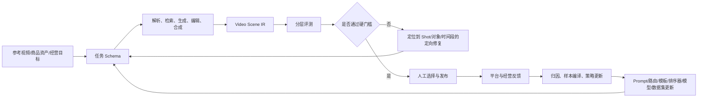
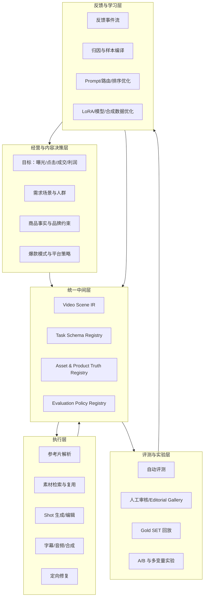
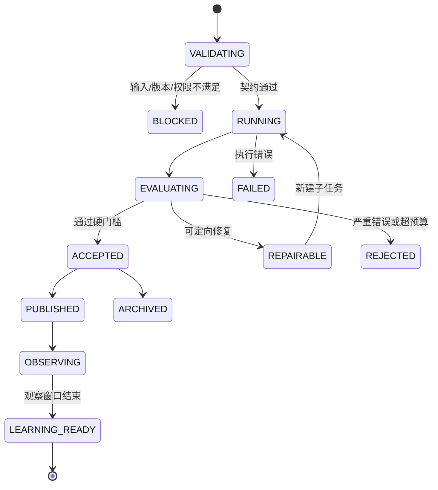
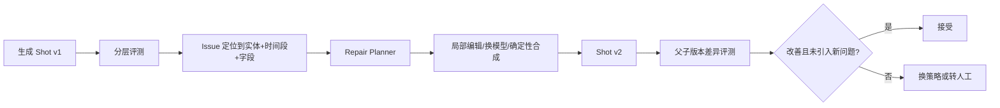

# 面向电商短视频生成与内容增长工厂的统一规范
## Video Scene IR、任务 Schema、数据格式、评测标准与反馈自优化体系

- **版本**：v0.1
- **日期**：2026-08-31
- **适用范围**：爆款参考视频拆解、商品资产复用、Shot Generation Optimizer、视频生成/编辑/混剪、确定性合成、Video Judge、Gold SET、人工审核、抖音/电商经营反馈闭环
- **文档性质**：架构规范 + 数据规范 + 评测规范 + 自优化实施方案

> 本文不是要求立即复现 GenCeption，也不是把所有视觉任务强行交给一个大模型。它将 GenCeption 的核心方法论——**统一任务表示、最小化底座改造、以数据表达承载任务差异、利用合成数据扩展能力**——转译为一套可以逐步落地到现有电商视频工程的系统规范。

---

# 1. 核心结论

对于当前视频工程，最值得建设的不是又一条“参考视频 → Prompt → 生成视频”的孤立流水线，而是四个长期稳定的基础层：

1. **Video Scene IR**：用统一中间表示描述“视频里有什么、为什么这样拍、各元素如何运动、如何被生成或复用、是否符合商品事实”。
2. **任务 Schema**：把拆解、检索、生成、编辑、合成、评测和学习任务变成可校验、可追踪、可重放的执行契约，而不是仅保存一段 Prompt。
3. **数据格式与数据契约**：明确媒体、Mask、深度、轨迹、文本、指标、反馈事件如何存储、对齐、版本化和追溯。
4. **评测标准**：把“看起来不错”拆成技术质量、时空一致性、商品保真、内容表达、平台经营结果和生产经济性，并建立离线评测与在线因果验证之间的连接。

四者共同形成一个可复利闭环：



最终目标不是“让模型自动生成更多视频”，而是：

> **让系统越来越准确地判断什么值得生成、哪些资产应该复用、哪里只需局部编辑、哪种 Shot 更可能被采用和跑赢，以及每获得一次反馈后应更新哪个组件。**

---

# 2. GenCeption 对本工程的可用启发与边界

GenCeption 将预训练视频生成模型改造成由文字任务指令驱动的统一前馈视觉模型；其稠密任务被转换到统一 RGB 表达空间，任务差异更多由数据表示承担，而不是为每项任务增加独立 Backbone、Head 和 Loss。论文也利用合成视频同时获得深度、法线、分割、关键点和相机等标注，并显示出较强的数据效率和 sim-to-real 泛化能力。[1][2]

对当前工程可直接继承的原则是：

| GenCeption 原则 | 视频工程中的转译 |
|---|---|
| 生成预训练底座内部包含时空与视觉语言先验 | 生成模型不应只作为末端 API，也可逐步承担理解、定位、编辑和验证任务 |
| 任务由文字指令切换 | 任务必须有标准化 `task_type + task_schema_version + output_contract`，自然语言 Prompt 只是其中一部分 |
| 稠密任务统一到标准表示 | 分割、深度、相机、轨迹等输出需映射到统一的 `ModalityAsset` 与坐标/时间规范 |
| 任务差异从模型结构迁移到数据表达 | 优先设计 IR、数据格式和标签体系，再决定是否增加专用模型或 Head |
| 合成数据同步产生多模态真值 | 以商品 3D/多视角资产、标准动作、场景和镜头轨迹构建可自动标注的数据工厂 |
| 尽量少破坏预训练底座 | 优先使用 Prompt、Adapter、LoRA、输出协议和路由，不为每个业务需求重改底座 |

但必须明确边界：

- GenCeption 主要证明的是**视觉与物理感知能力**，不是平台流量、营销叙事和商品转化智能。
- 深度、Mask、相机姿态等视觉结果，不能直接回答“这个 Hook 是否更容易留住用户”。
- 多任务统一并不意味着所有任务都应强制使用同一个模型。论文自己的消融也显示，一些任务在联合训练中会退化，尤其当新输出结构破坏原生注意力机制时。[2]
- 因此本工程采用的是**统一协议与统一 IR，底层模型可插拔**，而不是“一个模型包打天下”。

---

# 3. 四个核心概念的严格定义

## 3.1 Video Scene IR

### 定义

**Video Scene IR（视频场景中间表示）**是视频工程中的规范化、模型无关、可版本化“事实与意图状态”。它描述：

- 视频要解决什么经营与内容任务；
- 视频、Segment、Shot、帧、对象、文字、声音之间的结构关系；
- 商品与人物、场景、动作、镜头之间的时空关系；
- 每个元素来自原素材、检索、编辑还是生成；
- 每个结论的来源、置信度和版本；
- 每个 Shot 的验收条件、评测结果与反馈关联。

### 它不是什么

- 不是一段 Prompt；
- 不是最终 MP4；
- 不是某个模型私有输出；
- 不是只做镜头脚本的表格；
- 不是把所有像素数据都塞进一个 JSON。

### 核心价值

Video Scene IR 是以下模块之间的公共语言：

```text
参考片拆解器
  ↕
内容策划/脚本 Agent
  ↕
商品资产库与素材检索
  ↕
Shot Generation Optimizer
  ↕
图生视频/文生视频/视频编辑模型
  ↕
OpenMontage/Remotion/合成器
  ↕
Video Judge/人工审核
  ↕
线上数据与学习系统
```

没有 IR 时，每个模块都在重复“看一遍视频、猜一遍意图、重新拼 Prompt”；有 IR 后，模块只需读取和更新自己负责的字段。

---

## 3.2 任务 Schema

### 定义

**任务 Schema**是一个任务的可执行契约，规定任务的：

- 输入对象与版本；
- 输出对象与格式；
- 前置条件；
- 目标与约束；
- 可使用的模型、工具和资产；
- 成本、延迟、重试和降级策略；
- 质量门槛；
- 运行轨迹和反馈采集点。

### Prompt 与任务 Schema 的关系

```text
Prompt ⊂ Task Schema
```

Prompt 只表达给模型的自然语言指令；任务 Schema 还必须回答：

- 输入是哪一个 SKU、哪一个 Shot、哪个父版本；
- 哪些字段允许改变，哪些必须锁定；
- 输出必须返回哪些结构化证据；
- 使用什么模型、种子、分辨率、预算；
- 如何判断成功；
- 失败后是重试、换模型、局部修复还是转人工。

因此，未来沉淀的 Skill 应主要绑定任务 Schema，而不是只绑定 Prompt 模板。

---

## 3.3 数据格式与数据契约

### 定义

**数据格式**回答“数据如何物理表达与存储”；**数据契约**回答“这些字段在所有模块中必须具有什么一致含义”。

例如：

- Mask 是 PNG、RLE 还是视频；
- 深度值是米、相对深度还是归一化值；
- 时间是帧号、毫秒还是微秒；
- 坐标原点在哪里；
- 相机坐标系采用什么约定；
- 文件如何校验、寻址和版本化；
- 一个线上指标在什么时间点才可用于训练。

### 关键区别

| 层 | 解决的问题 | 示例 |
|---|---|---|
| 语义 IR | 这是什么、为什么存在、与什么关联 | `shot.semantic_role = hook` |
| 任务 Schema | 谁在什么约束下做什么 | `generate.shot.v2` 只允许改背景，不允许改商品 |
| 数据格式 | 数据以何种形式保存 | `mask.png`、`events.parquet`、`scene_ir.json` |
| 数据契约 | 字段含义如何保持一致 | 时间统一为微秒，区间统一为左闭右开 |

---

## 3.4 评测标准

### 定义

**评测标准**不是一个总分公式，而是一套可复现的测量协议，包括：

- 被评测对象；
- 数据集和样本切片；
- 指标定义；
- 人工、规则、模型和线上实验的角色；
- 硬门槛与软排序；
- 阈值、置信区间和版本；
- Judge 与真实经营结果之间的校准方法。

### 核心原则

1. **商品错误、违规和严重技术故障采用硬门槛，不允许被高审美分抵消。**
2. **离线质量分只能预测能否发布，不能替代线上增量实验。**
3. **评测必须定位到 Video → Segment → Shot → Entity → Time Range，而不是只给整片总分。**
4. **所有评分必须携带评分器版本、证据和置信度。**
5. **Judge 本身也需要 Gold SET、人工一致性和线上相关性评测。**

---

# 4. 总体目标架构



这一架构对应当前视频工厂的三条复利循环：

- **在线执行循环**：生成 → 评测 → 定向修复 → 交付；
- **离线优化循环**：Gold SET 回放 → 版本对比 → Prompt/路由/模型更新；
- **资产复利循环**：素材、Shot、失败案例、反馈和经营结果沉淀为可复用资产。

---

# 5. Video Scene IR 详细设计

## 5.1 分层对象模型

建议采用以下层级，而不是把所有信息平铺到 Shot 表：

```text
VideoProjectIR
├── BusinessContext
├── ProductTruth
├── NarrativePlan
├── VideoVariant
│   ├── Segment[]
│   │   └── Shot[]
│   │       ├── Beat[]
│   │       ├── EntityRef[]
│   │       ├── Relation[]
│   │       ├── CameraSpec
│   │       ├── ModalityAssetRef[]
│   │       ├── GenerationPlan
│   │       ├── AcceptancePolicy
│   │       └── EvaluationSummary
│   ├── AudioTrack[]
│   ├── OverlayTrack[]
│   └── RenderSpec
├── ProvenanceGraph
└── FeedbackRef[]
```

## 5.2 顶层对象定义

### 5.2.1 `VideoProjectIR`

| 字段 | 定义 |
|---|---|
| `ir_version` | IR 规范版本，如 `video_scene_ir.v0.1` |
| `project_id` | 一次经营/内容项目的稳定 ID |
| `video_family_id` | 同一创意母体或实验族 ID |
| `variant_id` | 当前成片变体 ID |
| `parent_variant_id` | 父版本，用于追踪局部修改 |
| `trace_id` | 一次端到端任务运行链路 ID |
| `business_context` | 平台、目标、人群、场景、预算和测试假设 |
| `product_truth` | SKU 事实、素材、约束、可证实卖点 |
| `narrative_plan` | Hook、主体、证明、CTA 等内容结构 |
| `timeline` | Segment、Shot、音频、字幕和画面轨道 |
| `provenance` | 每个字段和资产的来源、模型、版本、置信度 |
| `evaluation` | 当前版本的评测记录摘要 |
| `feedback_refs` | 与该版本相关的人工、系统、平台反馈事件 |

### 5.2.2 `BusinessContext`

必须把经营语义写入 IR，避免视频系统只优化画面：

```yaml
business_context:
  platform: douyin
  objective: product_click
  channel_stage: cold_start
  target_audience:
    need_scene: "洗澡后快速擦干、避免普通毛巾吸水慢"
    audience_tags: ["家庭用户", "注重柔软与吸水"]
  experiment:
    hypothesis_id: hyp_hook_contrast_001
    controlled_factors: ["body", "offer", "duration"]
    changed_factors: ["hook_visual", "hook_copy"]
  primary_metrics: ["3s_retention", "product_click_rate"]
  guardrail_metrics: ["negative_feedback_rate", "claim_compliance"]
```

### 5.2.3 `ProductTruth`

`ProductTruth` 是商品视频生成的硬约束源，不允许由生成模型自由发挥。

| 字段 | 定义 |
|---|---|
| `sku_id` | 稳定 SKU ID |
| `category` | 类目，如浴巾、桌垫、沙发垫 |
| `canonical_assets` | 官方多角度图、视频、Logo、包装、色卡 |
| `physical_attributes` | 尺寸、材质、颜色、纹理、结构 |
| `allowed_claims` | 可在内容中使用且有证据支持的卖点 |
| `claim_evidence` | 检测报告、商品详情、业务确认或实验依据 |
| `forbidden_claims` | 禁止夸大或无法证明的表达 |
| `identity_constraints` | Logo、图案、边缘、比例、颜色允许偏差 |
| `interaction_rules` | 可折叠、可铺设、可手持、不可出现的错误动作 |
| `replacement_policy` | 允许复用/替换的范围 |

示例：

```yaml
product_truth:
  sku_id: towel_001_blue
  category: bath_towel
  physical_attributes:
    color_lab: [62.1, -4.5, -18.2]
    material: "珊瑚绒"
    size_cm: [140, 70]
    edge_type: "包边"
  allowed_claims:
    - claim_id: claim_soft_touch
      text: "触感柔软"
      evidence_type: merchant_confirmed
    - claim_id: claim_absorb_demo
      text: "可展示吸水过程"
      evidence_type: test_video
  forbidden_claims:
    - "全网吸水第一"
    - "医学级抑菌"
  identity_constraints:
    logo_required: false
    color_delta_e_max: 6.0
    aspect_ratio_tolerance: 0.08
    pattern_lock: true
```

## 5.3 `ShotIR`：当前工程最应优先落地的核心对象

不建议第一阶段就实现完整 4D 场景。应先把 `ShotIR` 做成最小但稳定的中间层。

### 5.3.1 字段分组

#### A. 内容意图

| 字段 | 定义 |
|---|---|
| `semantic_role` | `hook/problem/demo/proof/benefit/contrast/cta` |
| `need_scene_id` | 对应用户需求场景 |
| `selling_point_ids` | 当前镜头承载的卖点 |
| `claim_ids` | 当前镜头明确或隐含表达的商品主张 |
| `message` | 用户看完该镜头应理解的一句话 |
| `attention_mechanism` | 反差、悬念、结果前置、痛点共鸣、视觉奇观等 |

#### B. 时间结构

| 字段 | 定义 |
|---|---|
| `start_us/end_us` | 微秒时间，区间统一为左闭右开 `[start_us, end_us)` |
| `beats` | Shot 内部的动作节拍与信息节拍 |
| `keyframes` | 关键帧及其语义 |
| `transition_in/out` | 与相邻 Shot 的视觉/语义/音频连接方式 |

#### C. 场景与对象

| 字段 | 定义 |
|---|---|
| `entities` | 商品、人物、手、容器、背景、文字等实体引用 |
| `relations` | `holds/on_top_of/occludes/touches/looks_at` 等时空关系 |
| `action` | 主体动作和商品交互动作 |
| `environment` | 场景、时间、天气、材质、光照 |
| `continuity_constraints` | 跨帧与跨 Shot 必须保持的一致性 |

#### D. 镜头语言

| 字段 | 定义 |
|---|---|
| `shot_size` | 特写、近景、中景、全景 |
| `camera_angle` | 平视、俯拍、仰拍、顶拍、主观视角 |
| `camera_motion` | 固定、推、拉、摇、移、环绕、手持 |
| `composition` | 主体区域、视觉重心、安全区、字幕避让区 |
| `focal_style` | 景深、焦点转移、镜头质感 |
| `lighting` | 主光方向、软硬、色温、对比度 |

#### E. 生成与复用策略

| 字段 | 定义 |
|---|---|
| `source_strategy` | `reuse/edit/generate/composite` |
| `source_asset_refs` | 参考片、商品片、历史 Shot 或模板 |
| `generation_spec_ref` | 对应的生成任务与参数 |
| `locked_elements` | 商品、构图、动作、文字等不可改变元素 |
| `editable_elements` | 背景、相机、字幕、光照等允许修改元素 |
| `fallback_plan` | 模型失败后的素材替换或确定性合成路径 |

#### F. 评测与反馈

| 字段 | 定义 |
|---|---|
| `acceptance_policy_ref` | 当前 Shot 的硬门槛与评分权重 |
| `evaluation_refs` | 自动和人工评测记录 |
| `issue_refs` | 结构化缺陷列表 |
| `feedback_refs` | 采用、拒绝、修改、线上结果等事件 |

### 5.3.2 示例

```json
{
  "shot_id": "shot_hook_001_v3",
  "semantic_role": "hook",
  "time_range": {"start_us": 0, "end_us": 2200000},
  "need_scene_id": "need_fast_dry_after_shower",
  "selling_point_ids": ["sp_absorb_demo"],
  "message": "普通毛巾擦很多次仍潮，这条浴巾一次快速吸走表面水分",
  "attention_mechanism": ["contrast", "result_first"],
  "beats": [
    {
      "beat_id": "b1",
      "time_range": {"start_us": 0, "end_us": 700000},
      "event": "湿手臂近景，水珠明显"
    },
    {
      "beat_id": "b2",
      "time_range": {"start_us": 700000, "end_us": 1600000},
      "event": "浴巾一次擦过"
    },
    {
      "beat_id": "b3",
      "time_range": {"start_us": 1600000, "end_us": 2200000},
      "event": "擦前擦后分屏对比"
    }
  ],
  "entities": ["entity_product_towel_001", "entity_arm_001", "entity_water_001"],
  "relations": [
    {
      "subject": "entity_product_towel_001",
      "predicate": "touches",
      "object": "entity_arm_001",
      "time_range": {"start_us": 700000, "end_us": 1600000}
    }
  ],
  "camera": {
    "shot_size": "close_up",
    "angle": "eye_level",
    "motion": "locked",
    "subject_region_norm": [0.15, 0.20, 0.85, 0.85]
  },
  "source_strategy": "composite",
  "locked_elements": ["product_identity", "product_color", "wipe_direction"],
  "editable_elements": ["background", "caption_style", "lighting"],
  "acceptance_policy_ref": "policy.product_demo_hook.v1",
  "provenance": {
    "derived_from_reference": "ref_video_027_shot_01",
    "planner_model": "planner_x@2026-08-20",
    "confidence": 0.86
  }
}
```

## 5.4 Entity、Track 与 Scene Graph

### `Entity`

稳定描述视频中的逻辑对象：

```yaml
entity_id: entity_product_towel_001
entity_type: product
sku_id: towel_001_blue
identity_embedding_ref: asset://embeddings/towel_001/v4
canonical_visual_refs:
  - asset://products/towel_001/front.png
  - asset://products/towel_001/folded.png
attributes:
  color: blue
  material: coral_fleece
```

### `Track`

描述实体在时间上的位置和可见性：

```yaml
track_id: track_product_001
entity_id: entity_product_towel_001
frame_range: [0, 52]
boxes_ref: asset://tracks/track_product_001.parquet
mask_video_ref: asset://masks/track_product_001.mp4
visibility:
  mean: 0.91
  occluded_ranges: [[18, 24]]
```

### `Relation`

必须带时间区间，避免把瞬时关系误当成全片事实：

```yaml
subject: entity_hand_001
predicate: holds
object: entity_product_towel_001
time_range_us: [720000, 1580000]
confidence: 0.94
source: model://relation_extractor/v2
```

## 5.5 ModalityAsset：把深度、Mask、法线、相机等变成可插拔资产

不是每条视频都需要预先计算全部视觉模态。采用“**核心 IR 常驻，昂贵模态按需生成**”策略。

| 模态 | 典型用途 | 何时必须生成 |
|---|---|---|
| Segmentation/Alpha | 商品替换、背景替换、字幕避让 | 需要局部编辑或商品身份校验时 |
| Object Track | 跨帧一致性、对象跟踪、局部修复 | 所有生成/编辑 Shot 建议生成 |
| Depth | 遮挡、景深、前后关系、重投影 | 商品插入、相机改动、复杂合成时 |
| Surface Normal | 重光照、材质与表面一致性 | 高质量商品重光照时 |
| Camera Pose/Raymap | 机位复刻、4D 重建、视角迁移 | 参考片机位复刻或自由视角时 |
| Optical Flow/Motion | 运动连续、局部变形检测 | 动作镜头与转场修复时 |
| Keypoints | 人体/手部动作、商品交互 | 人物演示和手物交互时 |
| OCR/Text Track | 花字还原、文字合规、字幕同步 | 所有带字视频 |
| Audio/ASR/Beat | 口播、节拍、镜头对齐 | 口播与音乐驱动视频 |

统一引用格式：

```yaml
modality_asset:
  asset_id: depth_shot_001_v2
  modality: depth_relative
  uri: s3://video-factory/silver/depth/shot_001_v2.exr
  mime_type: image/x-exr
  frame_count: 53
  time_base: {num: 1, den: 1000000}
  coordinate_convention: camera_opencv
  value_contract:
    unit: relative
    normalization: median_scene_depth
    valid_range: [0.0, 1.0]
  producer:
    task_run_id: run_depth_9821
    model: depth_model_x
    model_version: 2.1.0
  sha256: "..."
```

## 5.6 置信度、未知值与证据

IR 不允许模型用猜测填满字段。所有自动抽取结果应支持：

```yaml
value: "soft_diffused_light"
status: inferred          # observed / inferred / confirmed / disputed / unknown
confidence: 0.72
source_refs:
  - frame://shot_001/12
producer: model://vlm_parser/v5
review_status: unreviewed
```

关键商品事实必须由 `confirmed` 或可追溯证据覆盖；低置信度字段可触发人工复核或额外感知任务。

## 5.7 IR 分级，避免第一阶段过度工程化

| 级别 | 内容 | 适用阶段 |
|---|---|---|
| IR-L0 | Video/Segment/Shot、时间、脚本、字幕、来源、版本 | 立即落地 |
| IR-L1 | Entity、Track、场景关系、商品事实、生成/复用策略 | MVP 主体 |
| IR-L2 | Mask、Depth、Camera、Flow、Keypoint、物理关系 | 商品替换和高质量编辑 |
| IR-L3 | 线上反馈、因果实验、策略价值、可学习标签 | 自优化阶段 |

第一阶段的成功标准不是字段最多，而是**任何一个生成版本都能被唯一追踪到输入、任务、模型、资产、父版本、评测和反馈**。

---

# 6. 任务 Schema 详细设计

## 6.1 通用任务契约

```yaml
task_schema_version: task.v1
task_type: generate.shot
name: "生成单个商品演示镜头"

inputs:
  required:
    - shot_ir_ref
    - product_truth_ref
    - source_asset_refs
  optional:
    - reference_shot_ref
    - prior_issue_refs

objectives:
  primary: "在保持商品身份的前提下完成指定动作与镜头语言"
  secondary:
    - "减少人工编辑"
    - "控制生成成本"

constraints:
  locked_fields:
    - product_identity
    - product_color
    - duration
  editable_fields:
    - background
    - lighting
  prohibited:
    - unsupported_claim
    - logo_mutation

execution_policy:
  preferred_models:
    - model://video_edit_a/v4
    - model://image_to_video_b/v2
  fallback_strategy: deterministic_composite
  max_attempts: 3
  max_cost_usd: 1.20
  timeout_s: 180
  seed_policy: fixed_then_diversify

outputs:
  required:
    - output_video_asset_ref
    - updated_shot_ir_ref
    - task_trace_ref
    - generation_metadata
  optional:
    - mask_ref
    - depth_ref
    - issue_prediction

quality_gate:
  policy_ref: policy.product_demo.v1
  auto_repair_allowed: true
  human_review_required_when:
    - product_fidelity_score < 0.92
    - claim_risk > 0.10

feedback_hooks:
  capture:
    - accepted
    - rejected_reason
    - edit_operations
    - regeneration_count
    - publish_variant
```

## 6.2 必备字段

| 字段组 | 必须回答的问题 |
|---|---|
| `identity` | 这是什么任务、哪个版本、谁发起 |
| `inputs` | 输入对象是否完整、版本是否兼容 |
| `objectives` | 优化什么，不优化什么 |
| `constraints` | 哪些元素必须锁定，哪些可变 |
| `execution_policy` | 用什么模型、预算、重试、降级 |
| `outputs` | 必须返回什么结构化结果 |
| `quality_gate` | 怎样才算完成 |
| `trace` | 使用了哪些模型、参数、资产和耗时 |
| `feedback_hooks` | 后续要采集哪些可学习信号 |

## 6.3 任务族设计

| 任务族 | 典型任务 | 输入 | 输出 |
|---|---|---|---|
| Ingest | 视频转码、切 Shot、音画分离 | 原视频 | 标准媒体资产 |
| Perception | 分割、深度、相机、OCR、ASR、Track | 视频/Shot | ModalityAsset |
| Understanding | 需求场景、卖点、叙事角色、动作关系 | 标准资产 | 语义 IR |
| Planning | 脚本、分镜、ShotSpec、实验设计 | 商品事实+目标 | Narrative/ShotIR |
| Retrieval | 素材、模板、历史成功 Shot 匹配 | ShotIR | 候选资产与排序 |
| Routing | 复用/编辑/生成/合成决策 | IR+预算 | ExecutionPlan |
| Generation | 文生/图生/视频编辑 | ShotIR+资产 | 视频变体 |
| Composition | 字幕、音频、转场、Remotion 合成 | 多轨资产 | 成片 |
| Evaluation | 分层评分与缺陷定位 | 变体+IR | EvalRecord+Issue |
| Repair | 局部重做、补帧、商品修复、字幕修复 | Issue+父版本 | 子版本 |
| Learning | 样本编译、排序器训练、Prompt 优化 | 反馈事件 | 新策略/模型版本 |

## 6.4 两个关键任务示例

### 6.4.1 `reference_video.compile_ir.v1`

目标：把爆款参考片编译成结构化可复用资产，而不是只输出摘要。

```yaml
inputs:
  reference_video_ref: asset://references/ref_027.mp4
  product_context: optional
outputs:
  video_scene_ir_ref: ir://references/ref_027/v1
  shot_boundaries_ref: asset://boundaries/ref_027.parquet
  text_tracks_ref: asset://ocr/ref_027.jsonl
  audio_transcript_ref: asset://asr/ref_027.jsonl
  unresolved_fields: []
quality_gate:
  shot_boundary_f1_min: 0.90
  ocr_key_copy_recall_min: 0.95
  timeline_sync_error_ms_max: 80
  human_review_required_if:
    - semantic_role_confidence < 0.65
    - product_entity_track_lost = true
```

### 6.4.2 `repair.shot.targeted.v1`

目标：只修复失败对象或失败时间段，不重生成整条视频。

```yaml
inputs:
  parent_shot_ir_ref: ir://project_x/shot_03/v5
  issue_refs:
    - issue://product_logo_mutation/2231
  preserve:
    - camera_motion
    - audio
    - caption_timing
    - non_product_pixels
repair_scope:
  entity_ids: [entity_product_001]
  time_range_us: [2100000, 2480000]
execution_policy:
  preferred_method: masked_video_edit
  fallback: replace_with_source_asset_composite
outputs:
  child_shot_ir_ref: ir://project_x/shot_03/v6
  diff_ref: diff://project_x/shot_03/v5..v6
quality_gate:
  compare_against_parent: true
  must_improve:
    - product_fidelity
  must_not_regress_more_than:
    temporal_consistency: 0.02
    caption_sync: 0.00
```

## 6.5 Task Run 状态机



---

# 7. 数据格式与数据契约

## 7.1 存储职责分离

不要用一个数据库承担全部数据：

| 数据类型 | 推荐载体 | 原因 |
|---|---|---|
| 原始/生成媒体 | 对象存储 | 大文件、版本多、便于 CDN/生命周期管理 |
| IR 与任务元数据 | PostgreSQL JSONB 或文档库 | 需要事务、查询和版本关系 |
| 帧级/事件级表 | Parquet/Iceberg/Delta | 批量分析、训练和回放 |
| 反馈事件 | Append-only Event Log + Parquet | 保留原始事实，支持重算 |
| Embedding | 向量数据库 | 素材、Shot、需求场景和失败案例检索 |
| 模型/Prompt/策略版本 | Model/Policy Registry | 可回滚、可比较、可审计 |
| 在线特征 | Feature Store/低延迟 KV | 排序与路由实时使用 |

## 7.2 推荐的数据分层

```text
data/
├── bronze/                 # 原始不可变
│   ├── references/
│   ├── product_assets/
│   ├── generated_outputs/
│   └── platform_exports/
├── silver/                 # 标准化与结构化
│   ├── media_normalized/
│   ├── scene_ir/
│   ├── modalities/
│   ├── task_runs/
│   └── feedback_events/
├── gold/                   # 经审核、可评测、可训练
│   ├── goldset/
│   ├── preference_pairs/
│   ├── regression_cases/
│   ├── training_examples/
│   └── experiment_results/
└── registry/
    ├── schemas/
    ├── prompts/
    ├── policies/
    ├── models/
    └── datasets/
```

## 7.3 基础媒体规范

### 视频

```yaml
container: mp4
video_codec: h264_or_h265
pixel_format: yuv420p
color_space: bt709
frame_rate:
  numerator: 24
  denominator: 1
resolution: [1080, 1920]
rotation_applied: true
time_base: microsecond
```

原始文件可以保留任意编码，但进入 Silver 层必须生成标准代理文件。不要通过重新编码覆盖原文件。

### 时间规范

- 所有逻辑时间统一用整数微秒：`time_us`。
- 所有区间采用左闭右开：`[start_us, end_us)`。
- 帧号仅作为派生索引，不作为跨转码版本的主时间依据。
- 必须记录 `fps_num/fps_den`，不要用浮点 `29.97` 代替有理数。

### 二维坐标

- 原点：左上角；
- X 向右，Y 向下；
- 逻辑框优先保存归一化坐标 `[0,1]`；
- 像素坐标必须同时记录对应画面尺寸；
- Box 统一为 `[x_min, y_min, x_max, y_max]`。

### 三维与相机坐标

建议以 OpenCV 相机坐标作为内部标准：

- X 向右；
- Y 向下；
- Z 向前；
- 外部 Blender/OpenGL 数据必须携带显式变换矩阵；
- 相机内参、外参、畸变参数不可省略单位和约定。

### Mask

- 二值静态 Mask：PNG；
- 长视频 Mask：无损视频或帧序列；
- 大规模标注：COCO RLE/Parquet；
- 软 Alpha 必须记录 `[0,1]` 浮点语义，不能与二值 Mask 混用。

### Depth

深度必须显式区分：

```yaml
depth_type: metric | relative | inverse | normalized
unit: meter | none
normalization: none | median_scene | minmax | log
invalid_value: null
camera_intrinsics_ref: optional
```

### 文本与音频

- ASR、OCR、字幕统一使用带时间戳的 JSONL；
- 每个 token/句子必须区分 `observed_text` 与人工修订后的 `canonical_text`；
- 音频响度、采样率、声道、语言和说话人 ID 进入契约。

## 7.4 `AssetRef` 统一格式

```json
{
  "asset_id": "asset_video_000128",
  "uri": "s3://video-factory/silver/media/000128.mp4",
  "mime_type": "video/mp4",
  "sha256": "...",
  "size_bytes": 18922342,
  "created_at": "2026-08-31T16:02:11Z",
  "source_kind": "generated",
  "license": "merchant_owned",
  "producer": {
    "task_run_id": "run_01828",
    "model_id": "video_model_a",
    "model_version": "4.2.1"
  },
  "media_contract": {
    "width": 1080,
    "height": 1920,
    "fps_num": 24,
    "fps_den": 1,
    "duration_us": 5200000
  }
}
```

## 7.5 `TaskResultEnvelope`

任何模型或工具都不能只返回一个文件路径：

```yaml
task_result:
  task_run_id: run_01828
  task_type: generate.shot
  task_schema_version: task.v1
  status: succeeded
  input_snapshot_ref: snapshot://run_01828/input
  output_refs:
    - asset://asset_video_000128
    - ir://project_x/shot_01/v3
  metrics:
    latency_ms: 78210
    cost_usd: 0.84
    gpu_seconds: 41.7
  model_trace:
    model_id: video_model_a
    model_version: 4.2.1
    prompt_profile: prompt://product_demo/v7
    seed: 118293
  warnings: []
  created_at: 2026-08-31T16:03:29Z
```

## 7.6 Schema 与版本策略

- IR、Task、Eval、Feedback 分别独立版本化；
- 新增可选字段允许小版本兼容；
- 删除、改名、改变语义必须升主版本；
- 所有任务运行保存输入 Schema 快照，不能只引用“最新版”；
- 数据迁移必须可重放；
- 训练样本必须记录其编译器版本。

推荐版本标识：

```text
video_scene_ir.v0.1
shot_ir.v0.3
task.generate_shot.v2
eval.product_demo.v1
feedback_event.v1
dataset.goldset.home_textile.v4
```

---

# 8. 评测标准：Gate 0 + 六层评价体系

## 8.1 为什么不能只有一个 VideoScore

一个整片总分会掩盖关键风险：

- 商品 Logo 错了，但画面美感很高；
- Hook 很强，但卖点是虚假的；
- 视觉质量很好，但商品点击率低；
- 点击率高，但生成成本和人工返工过高；
- 一条视频跑赢，但无法确认究竟是 Hook、商品、投流还是发布时间造成。

因此采用“**硬门槛 + 多维分数向量 + 任务特定排序策略**”。

## 8.2 Gate 0：数据、合规与致命故障

Gate 0 不计入加权平均，只判定 Pass/Fail。

| 检查项 | 失败条件示例 |
|---|---|
| 数据完整 | 文件损坏、时长为零、缺关键 IR、时间轴错位 |
| 商品身份 | SKU 错、Logo/图案严重变形、颜色越界 |
| 主张合规 | 使用无证据卖点、禁用词、前后矛盾 |
| 基础技术 | 黑屏、静帧、音画严重不同步、字幕不可读 |
| 权利与来源 | 素材授权不明、人物肖像/音乐权限不满足 |

任何 Gate 0 失败都必须拒绝发布，不能被其他高分抵消。

## 8.3 L1：媒体技术质量

### 定义

衡量文件是否可正常观看、画面与声音是否达到交付标准。

### 主要指标

- 分辨率、帧率、码率、编码兼容；
- 黑帧率、冻结帧率、重复帧率；
- 清晰度、压缩伪影、噪点；
- 闪烁、曝光突变、色彩断层；
- 音画同步误差；
- 口播响度、削波、底噪；
- 字幕安全区、字号、对比度和显示时长。

### 输出要求

```yaml
layer: L1_media_technical
score: 0.88
issues:
  - code: caption_safe_area_violation
    severity: medium
    time_range_us: [4200000, 5100000]
    evidence_ref: frame://video_001/108
```

## 8.4 L2：时空、对象与物理一致性

### 定义

衡量视频是否维持对象身份、几何结构、动作、遮挡、机位与时间连续性。

### 主要指标

- 商品/人物跨帧身份一致性；
- 对象永久性和 Track 丢失率；
- 商品边缘、纹理、形状和局部结构稳定；
- 手与商品接触关系是否合理；
- 深度顺序和遮挡关系；
- 相机轨迹平滑度与突跳；
- Optical Flow 残差和局部运动异常；
- 动作速度、惯性、材质形变是否可信；
- Shot 连接处的空间与动作连续性。

### 与 GenCeption 能力的关系

深度、法线、相机姿态、分割和关键点可作为本层的结构化证据，但不要求一开始由同一个模型提供。[1][2]

## 8.5 L3：商品保真、品牌与编辑保真

### 定义

衡量生成/编辑后的视频是否仍然忠实于真实商品与品牌资产。

### 主要指标

- SKU 检索/识别匹配；
- Logo OCR 与形态一致；
- 图案、边缘、缝线、包装结构；
- 色差 `ΔE`；
- 尺寸与比例误差；
- 产品在不同姿态下的身份一致性；
- 卖点演示是否由真实商品或可证实条件支持；
- 局部编辑是否破坏未编辑区域；
- 与锁定元素的差异是否超出容忍度。

### 重要规则

`L3` 是电商视频区别于普通生成视频的核心层。对于商品特写和证明镜头，应比审美分拥有更高权重，并设置硬阈值。

## 8.6 L4：内容结构、注意力与表达质量

### 定义

衡量视频是否对目标人群清楚地表达需求场景、开场承诺、卖点证据和行动指令。

### 主要指标

- Hook 是否在目标时间窗内被理解；
- 需求场景匹配度；
- 开场承诺与后续内容是否一致；
- 卖点覆盖、证据密度和信息冗余；
- 结果前置、冲突、反差、悬念等机制是否成立；
- 镜头节奏、信息节拍和注意力变化；
- 字幕、口播、画面是否重复或互补；
- CTA 是否自然、明确、与经营目标一致；
- 参考片复刻是否超越了原片的平庸结构，而不是忠实复制卖点清单。

### 评测方法

- 业务专家标注；
- 成对偏好比较；
- 结构化 VLM/LLM Judge；
- 首帧、前 1/3/5 秒和关键 Shot 的独立评测；
- 与线上留存指标进行校准。

## 8.7 L5：平台与经营效果

### 定义

衡量视频在真实分发和交易环境中的增量价值。

### 指标组

| 阶段 | 指标示例 |
|---|---|
| 注意力 | 1 秒/3 秒/5 秒留存、完播、复看 |
| 互动 | 点赞、评论、分享、收藏、负反馈 |
| 兴趣 | 主页访问、商品卡点击、搜索行为 |
| 转化 | 加购、下单、支付转化率、客单价 |
| 经营 | GMV、毛利、贡献毛利、投放 ROI、CAC |
| 长期 | 新客质量、退款、复购、内容资产复用价值 |

平台指标口径可能变化，因此必须在 `MetricRegistry` 中记录平台、版本、分母、观察窗口和数据可得时间，不能把字段名当成永久语义。

## 8.8 L6：生产经济性与学习价值

### 定义

衡量系统是否真正降低了找到优质视频的成本，而不仅是生成数量增加。

### 主要指标

- 单个可采用 Shot 成本；
- 单条可发布视频成本；
- 首次通过率；
- 平均重生成次数；
- 人工编辑秒数/操作数；
- 从需求到首个可接受版本的延迟；
- 复用素材占比；
- 局部修复占比；
- 模型调用失败率；
- 每获得一个线上有效结论的实验成本；
- 新样本对 Gold SET、模板和模型的增量价值。

## 8.9 评分与决策规则

### 硬门槛

```text
Acceptable = Gate0_Pass
             AND L1 >= T1
             AND L2 >= T2
             AND L3 >= T3
```

### 软排序

不同任务使用不同权重：

```text
OfflineRankScore(policy) = Σ wi(policy) × Li
```

例如：

| 策略 | L1 | L2 | L3 | L4 | L6 |
|---|---:|---:|---:|---:|---:|
| 商品替换镜头 | 0.10 | 0.25 | 0.40 | 0.15 | 0.10 |
| Hook 探索镜头 | 0.10 | 0.15 | 0.20 | 0.45 | 0.10 |
| 品牌成片 | 0.15 | 0.20 | 0.30 | 0.25 | 0.10 |

权重只是版本化策略，不是永久真理。线上结果积累后应重新校准。

### 线上效用

```text
OnlineUtility
= IncrementalContributionMargin
- λ1 × GenerationCost
- λ2 × HumanEditCost
- λ3 × LatencyPenalty
- λ4 × ComplianceRisk
```

系统最终应优化的是预期线上效用，而不是离线总分。

## 8.10 Gold SET 设计

Gold SET 不只是“爆款视频集合”，至少包含五类样本：

| 子集 | 目的 |
|---|---|
| `reference_best` | 高质量参考与结构模式 |
| `product_truth` | 商品身份、颜色、图案、Logo、交互真值 |
| `failure_cases` | 变形、闪烁、错字、假卖点、错误遮挡等 |
| `regression_set` | 每次系统升级都必须不退化的历史案例 |
| `online_validated` | 经过受控线上实验验证的变体对 |

每个样本必须带：

- 原始资产；
- Scene IR；
- 任务输入；
- 参考答案或偏好；
- 评分理由与证据；
- 样本切片标签；
- 数据版本与许可；
- `available_at`，防止训练时使用未来信息。

## 8.11 Judge 的评测标准

Video Judge 也必须被评测：

- 与人工专家的成对偏好准确率；
- Spearman/Kendall 排序相关；
- 严重错误召回率；
- 各类目、画幅、人物/无人物、真实/生成等切片偏差；
- 置信度校准误差；
- 与线上指标的相关性和增量预测能力；
- 对“画面好看但商品错误”的抗欺骗能力。

Judge 不能直接自证正确。只有经过人工 Gold SET 和线上结果校准的 Judge 才能参与自动放行。

---

# 9. 反馈数据模型

## 9.1 四类反馈

### A. 显式人工反馈

- 接受/拒绝；
- 候选 A/B 偏好；
- 拒绝原因；
- 修改后的字段；
- 业务专家对需求场景、卖点和结构的修订。

### B. 隐式生产反馈

- 是否反复重生成；
- 哪个候选被拖入时间线；
- 哪些片段被裁掉；
- 哪些字幕被修改；
- 人工编辑耗时；
- 采用前修改了多少参数；
- 是否从生成方案切换为素材复用。

### C. 自动评测反馈

- 分层分数；
- 缺陷代码；
- 缺陷时间段、实体和证据；
- Judge 置信度；
- 父子版本改善/退化情况。

### D. 平台与经营反馈

- 曝光、留存、互动、点击、转化、毛利；
- 测试组与对照组；
- 投流、人群、时段、价格、库存等上下文；
- 观察窗口和数据可得时间。

## 9.2 `FeedbackEvent` 标准格式

```json
{
  "feedback_event_version": "feedback.v1",
  "event_id": "fb_001892",
  "event_type": "human.reject",
  "event_time": "2026-08-31T15:20:00Z",
  "observed_at": "2026-08-31T15:20:03Z",
  "available_at": "2026-08-31T15:20:03Z",
  "trace_id": "trace_0082",
  "project_id": "project_towel_001",
  "variant_id": "video_v17",
  "scope": {
    "level": "shot",
    "shot_id": "shot_hook_001_v3",
    "entity_id": "entity_product_towel_001",
    "time_range_us": [700000, 1600000]
  },
  "actor": {
    "type": "human_reviewer",
    "role": "content_operator"
  },
  "signal": {
    "value": "reject",
    "reason_codes": ["product_texture_unstable", "hook_result_unclear"],
    "severity": "high",
    "free_text": "擦拭过程中浴巾纹理变化，且对比结果不够明显"
  },
  "attribution": {
    "method": "direct_review",
    "confidence": 0.95
  },
  "context_ref": "snapshot://trace_0082/review_context"
}
```

## 9.3 时间与防泄漏

必须区分：

- `event_time`：现实事件发生时间；
- `observed_at`：系统首次观察时间；
- `available_at`：决策系统可以合法使用该数据的时间；
- `window_end`：线上指标统计窗口结束时间。

训练和回放只能使用决策时点之前 `available_at` 已到的数据，避免未来数据泄漏。

## 9.4 统一原因码

自由文本用于补充，训练标签应优先使用稳定原因码：

```text
TECH_*          黑帧、音画不同步、字幕不可读
TEMPORAL_*      闪烁、对象漂移、运动突跳
PRODUCT_*       SKU 错、颜色错、Logo 变形、纹理不稳
CONTENT_*       Hook 弱、卖点不清、需求场景不匹配
COPY_*          错字、花字不匹配、字幕与口播冲突
COMPLIANCE_*    无证据主张、版权、敏感内容
COST_*          调用过贵、重试过多、延迟过高
ONLINE_*        留存弱、点击弱、转化弱、退款高
```

原因码必须能映射到具体修复任务和可更新组件。

---

# 10. 反馈驱动的自优化体系

## 10.1 不要把“自优化”理解为自动微调大模型

自优化有八个不同对象，成本和风险完全不同：

1. Prompt 与 Prompt 模块；
2. Shot 模板与内容结构；
3. 素材检索与复用排序；
4. 模型路由和参数；
5. 候选排序器；
6. Judge 与阈值；
7. LoRA/Adapter/专用模型；
8. 合成数据生成策略和 Gold SET。

大多数早期收益来自前五项，而不是立即微调 14B 视频底座。

## 10.2 三层学习目标

### 第一层：可生成、可发布

学习目标：

```text
P(pass_hard_gate | task, assets, model, params)
P(human_accept | pass, shot_ir, output)
```

使用：自动评测、人工接受/拒绝、重生成和编辑数据。

### 第二层：线上跑赢

学习目标：

```text
E[incremental_online_value | published_variant, context]
```

使用：受控实验、平台和经营指标。

### 第三层：单位成本找到更多赢家

```text
ExpectedUtility
= P(pass)
× P(accept | pass)
× E(online_increment | accepted)
- generation_cost
- edit_cost
- delay_cost
- risk_penalty
```

候选生成、路由和预算分配应最终围绕该效用，而不是单独最大化美学分。

## 10.3 三个时间尺度的优化闭环

### 闭环 A：单次运行内的定向自修复（秒到分钟）



关键要求：

- Issue 必须结构化，而不是“画面不够好”；
- Repair Task 必须声明保留项；
- 只重做失败 Shot、对象或时间段；
- 每次修复保存父子 Diff；
- 达到成本/重试预算后停止。

### 闭环 B：日常策略优化（天到周）

更新对象：

- Prompt 模块；
- 模型路由；
- Seed、步数、参考强度等参数；
- 素材检索排序；
- Shot 模板；
- 候选排序器；
- Judge 校准。

推荐方法：

| 对象 | 可用方法 |
|---|---|
| Prompt/参数 | 贝叶斯优化、离线回放、成对偏好 |
| 模型路由 | Contextual Bandit、成本约束路由 |
| 素材检索 | Learning-to-Rank、难负样本 |
| 候选排序 | Pairwise Ranker、校准后的接受概率 |
| Judge | 人工标注监督、温度缩放、分切片校准 |
| Shot 模板 | 受控 A/B、分层贝叶斯更新 |

### 闭环 C：模型与数据资产复利（周到月）

更新对象：

- 感知模型；
- 商品身份适配器；
- 视频编辑 LoRA；
- 类目专属动作/材质模型；
- 合成数据生成器；
- Gold SET 与 Regression Set。

仅使用高置信度样本：

```text
训练候选样本
= 明确任务输入
+ 明确输出版本
+ 通过商品与合规门槛
+ 有人工确认或强因果反馈
+ 来源和许可清晰
+ 不与 Holdout 重叠
```

## 10.4 从反馈到更新对象的路由表

| 反馈 | 首选更新对象 | 不应首先做的事 |
|---|---|---|
| 商品纹理跨帧不稳 | 商品锁定参数、参考图选择、编辑路由、商品 LoRA | 修改营销脚本 |
| 花字风格不匹配 | OCR/Caption IR、字体资产、字幕模板 | 重训视频底座 |
| Hook 看不懂 | Shot 结构、首帧、文案、动作节拍 | 只提高分辨率 |
| 参考片结构平庸 | Narrative Planner、超越参考规则 | 更忠实复刻镜头 |
| 生成成本高 | 复用路由、局部修复、低成本模型 | 直接降低质量阈值 |
| 离线分高但留存低 | L4 Judge 校准、实验设计、内容策略 | 继续提高审美权重 |
| 点击高但转化低 | 商品承诺一致性、落地页、价格/人群上下文 | 归因给生成模型画质 |
| 某类场景反复失败 | 主动学习、合成难例、专用 Adapter | 无差别扩大训练集 |

## 10.5 样本编译器

反馈不能直接进入训练集。需要 `Learning Example Compiler`：


输出类型：

- SFT 样本：输入 IR → 目标 IR/输出；
- Preference Pair：A 优于 B，并带原因；
- Ranking 样本：候选列表与采用顺序；
- Hard Negative：视觉相似但商品错误的素材；
- Repair Pair：父版本缺陷 → 子版本修复；
- Causal Pair：只有一个因素变化且线上结果显著不同；
- Regression Case：曾发生且必须永久防止的严重错误。

## 10.6 线上反馈的归因：避免“结果倒推假归因”

整条视频的 GMV 不能直接分摊给每一个 Shot。归因分四级：

| 等级 | 方法 | 可信度 |
|---|---|---|
| A | 随机对照，只改变一个因素 | 最高 |
| B | 因子实验/正交实验，记录多因素组合 | 高 |
| C | 匹配、DID、因果模型等观察性方法 | 中 |
| D | 单条爆款后验解释、Shapley 式推断 | 低，只用于生成假设 |

对现有“固定主体内容、批量替换前几秒 Hook”的策略，应强制写入实验 IR：

```yaml
experiment:
  family_id: exp_hook_20260831
  invariant_fields:
    - body_shots
    - product
    - offer
    - publish_window
    - audience_targeting
  treatment_fields:
    - hook_pattern
    - hook_copy
    - hook_visual
  randomization_unit: account_audience_bucket
  primary_metric: 3s_retention
  secondary_metric: product_click_rate
  guardrails:
    - negative_feedback_rate
    - conversion_rate
```

只有在这种条件下，才能把结果更新到“Hook 模式先验”。

## 10.7 分层贝叶斯与冷启动

对于桌垫、沙发垫、毛巾、浴巾等类目，单个 SKU 数据稀疏。可使用分层结构共享信号：

```text
全平台先验
  → 家居软装类目先验
    → 商品形态先验（铺设/擦拭/覆盖）
      → 品牌先验
        → SKU 先验
          → 当前视频变体
```

新 SKU 可以继承类目和动作模式先验，但随着自身数据增加逐步更新。这样既避免完全冷启动，也避免把其他类目经验生搬硬套。

## 10.8 Contextual Bandit 的使用边界

可用于：

- 在已通过硬门槛的候选中分配测试流量；
- 在多个生成模型之间平衡效果、成本和探索；
- 在多个 Hook 模式之间动态分配预算。

不可用于：

- 绕过商品合规和质量门槛；
- 在没有可比曝光或随机化时直接学习；
- 用短期点击牺牲长期退款、品牌和毛利。

奖励函数应包括业务价值与护栏：

```text
Reward
= w1 × RetentionUplift
+ w2 × ClickUplift
+ w3 × ContributionMarginUplift
- w4 × NegativeFeedback
- w5 × RefundRisk
- w6 × ProductionCost
```

## 10.9 Judge 与线上结果的联合校准

建立两级模型：

1. `Quality Pass Model`：预测是否通过技术、商品与人工采用门槛；
2. `Business Win Model`：在已通过质量门槛的候选中预测线上增量。

不要让一个 Judge 同时承担“画面是否变形”和“能否带来 GMV”两类语义完全不同的任务。

校准流程：

```text
离线 Judge 分数
→ 与人工偏好对齐
→ 与可发布率对齐
→ 与线上留存/点击做分切片相关性
→ 在受控实验中验证增量排序能力
→ 更新阈值或重训 Ranker
```

## 10.10 自动更新的安全门槛

| 更新类型 | 自动化程度 | 发布要求 |
|---|---|---|
| Prompt 小版本 | 高 | Gold SET 回放不退化，可灰度 |
| 模型路由权重 | 高 | 成本与通过率护栏，可回滚 |
| 素材排序器 | 高 | 离线 NDCG/采用率提升，影子部署 |
| Judge 阈值 | 中 | 人工一致性与严重错误召回不退化 |
| Shot 模板策略 | 中 | 受控线上实验 |
| LoRA/Adapter | 低到中 | Holdout、回归集、人工审核、Canary |
| 底座模型更新 | 低 | 全量回放、跨类目测试、明确回滚 |

任何学习版本都必须包含：

- 训练数据 Manifest；
- 代码和 Schema 版本；
- 离线评测；
- 与生产版本对比；
- 适用切片；
- 已知限制；
- 回滚指针。

---

# 11. 与现有视频工程的模块映射

| 当前/规划模块 | 在新架构中的位置 | 需要新增的关键能力 |
|---|---|---|
| 300–500 条爆款 Gold SET | `gold/reference_best` + `online_validated` | 不只保存视频，还保存 IR、切片、评测与实验上下文 |
| 爆款拆解 | `reference_video.compile_ir` | 输出 Shot 角色、对象、关系、来源和置信度，而非只输出总结 |
| Shot Generation Optimizer | `plan.shot + route.shot + generate.shot` | 读取标准 ShotIR；记录参数、候选、评测和反馈 |
| 人工 Prompt/模板积累 | Prompt Registry | 从散落文本升级为版本化 Prompt Profile，并绑定 Task Schema |
| 商品链接/商品资产库 | Product Truth + Asset Registry | 建立 SKU 身份、色卡、图案、允许卖点和交互规则 |
| OpenStory/故事规划 | Narrative Planner | 只负责叙事结构，不直接决定所有视觉执行细节 |
| OpenMontage/混剪 | Execution Compiler | 将 IR 编译为检索、剪辑、生成和合成任务图 |
| Remotion/确定性合成 | Composition Task | 读取统一时间线、字幕和 AssetRef，保证可重现 |
| Editorial Gallery/人工挑选 | Human Feedback UI | 强制采集采用、拒绝原因、编辑操作与偏好对 |
| VideoScore/Video Judge | Evaluation Plugins | 输出分层 EvalRecord 与可修复 Issue，而非单个总分 |
| 抖音/电商经营数据 | Online Feedback Store | 绑定 variant、实验组、观察窗口和 available_at |
| 自动研究/长期优化 Harness | Learning Orchestrator | 运行回放、实验、更新、Canary 与回滚 |

---

# 12. 最小可行实施路径

## P0：先建立可追踪闭环，不改模型

### 必做

1. 统一 `project_id / video_family_id / variant_id / shot_id / trace_id / task_run_id`；
2. 实现 IR-L0 + 最小 ShotIR；
3. 实现 `AssetRef`、`TaskResultEnvelope`、`FeedbackEvent`；
4. 所有生成、编辑和合成任务记录模型、参数、Prompt 版本、成本和父版本；
5. 人工审核界面增加结构化原因码；
6. 建立 Gate 0 与 L1/L3 基础检查；
7. 把已有 Gold SET 迁移为 Dataset Manifest。

### 验收

- 任意成片可回溯到所有输入和模型调用；
- 任意人工拒绝可定位到 Shot 和原因；
- 任意子版本可比较父版本改变了什么；
- 不再出现“只有 MP4，不知道怎么生成的”。

## P1：让参考片、商品和 Shot 进入统一 IR

### 必做

1. 自动切 Shot、OCR、ASR、对象 Track；
2. 商品资产注册与 ProductTruth；
3. 需求场景、Hook 模式、商品角色和卖点标签；
4. Shot 复用/编辑/生成路由；
5. L2/L4 基础 Judge；
6. 定向修复任务。

### 验收

- 输入参考片可生成可审核的 Scene IR；
- 系统能判断一个 Shot 是复用、编辑还是生成；
- 商品错误能被自动拦截；
- 至少一类缺陷可以只修复局部而非重做全片。

## P2：建立日常自优化

### 必做

1. 候选偏好对与编辑轨迹采集；
2. Prompt/模型路由离线回放；
3. 候选接受概率 Ranker；
4. Judge 对人工 Gold SET 的校准；
5. 成本、延迟和采用率联合优化；
6. Regression Set 自动回放。

### 验收

- 新版本在固定 Gold SET 上可量化比较；
- 单个可采用 Shot 成本持续下降；
- 人工修改次数和重生成次数下降；
- Judge 的严重错误召回和人工一致性达到可自动门控水平。

## P3：接入线上因果反馈和资产复利

### 必做

1. 视频变体与平台指标一一绑定；
2. 固定主体、替换 Hook 等受控实验；
3. 分层贝叶斯/Contextual Bandit；
4. 线上胜出模式回流到模板、排序和预算策略；
5. 高置信度 Repair Pair、Preference Pair 编译；
6. 商品类目合成数据与 Adapter/LoRA 训练。

### 验收

- 能回答“哪个具体变化导致留存/点击改善”；
- 系统能把预算更多分配给高预期效用候选；
- 线上反馈能明确更新到某个模板、Prompt、路由或模型；
- 新 SKU 冷启动能继承类目先验，并随自身数据更新。

---

# 13. 推荐服务与代码目录

```text
video-intelligence-platform/
├── schemas/
│   ├── video_scene_ir/
│   ├── task/
│   ├── evaluation/
│   └── feedback/
├── services/
│   ├── asset_registry/
│   ├── product_truth_service/
│   ├── scene_ir_service/
│   ├── task_orchestrator/
│   ├── perception_gateway/
│   ├── shot_optimizer/
│   ├── execution_compiler/
│   ├── evaluator/
│   ├── feedback_ingestor/
│   ├── experiment_service/
│   └── learning_orchestrator/
├── plugins/
│   ├── detectors/
│   ├── segmenters/
│   ├── depth_models/
│   ├── video_generators/
│   ├── video_editors/
│   ├── judges/
│   └── renderers/
├── datasets/
│   ├── manifests/
│   ├── goldset/
│   ├── regression/
│   └── synthetic/
├── policies/
│   ├── routing/
│   ├── evaluation/
│   ├── repair/
│   └── experiment/
├── pipelines/
│   ├── reference_to_ir/
│   ├── shot_generate/
│   ├── targeted_repair/
│   ├── video_compile/
│   └── feedback_learning/
└── tests/
    ├── schema_contract/
    ├── golden_replay/
    ├── regression/
    └── end_to_end/
```

## 13.1 最小 API

```text
POST /v1/assets/register
POST /v1/products/{sku_id}/truth
POST /v1/ir/compile-reference
GET  /v1/ir/{ir_id}
POST /v1/tasks/execute
GET  /v1/traces/{trace_id}
POST /v1/evaluations/run
POST /v1/feedback/events
POST /v1/experiments
POST /v1/learning/compile-examples
POST /v1/releases/canary
POST /v1/releases/rollback
```

---

# 14. 关键产品界面要求

## 14.1 Shot Inspector

右侧面板建议按以下区块展示：

1. 内容角色：Hook/证明/卖点/CTA；
2. 商品事实：SKU、卖点证据、锁定元素；
3. 对象与时间：实体、Track、动作和关系；
4. 镜头语言：机位、运动、构图、光照；
5. 来源策略：复用/编辑/生成/合成；
6. 版本树：父版本、修改字段、模型与成本；
7. 评测：Gate、L1–L6、问题定位；
8. 反馈：接受、拒绝原因、人工修改；
9. 修复按钮：基于 Issue 自动生成定向修复任务。

## 14.2 人工反馈交互

避免只有“喜欢/不喜欢”。至少支持：

- 接受；
- 拒绝；
- A 优于 B；
- 问题发生在哪个 Shot/时间段；
- 原因码；
- 哪些元素必须保留；
- 修改了哪些字段；
- 是否愿意发布；
- 业务判断置信度。

人工操作本身就是高价值训练数据，必须自动记录成结构化 Diff。

---

# 15. 关键反模式

1. **把 Prompt 当作全部资产**：无法校验输入、输出、版本和反馈。
2. **所有视频预计算全部视觉模态**：成本高且大部分无用，应按任务惰性生成。
3. **只存最终 MP4**：无法局部修复、归因和复现。
4. **一个总分决定发布**：会掩盖商品错误和合规风险。
5. **把爆款结果直接归因给某个镜头模式**：没有受控实验就只是后验故事。
6. **将人工自由文本直接拿去训练**：标签噪声、含义漂移、无法审计。
7. **直接用线上 GMV 微调生成模型**：反馈稀疏、延迟、混杂严重，信用分配错误。
8. **每个任务增加独立模型和私有格式**：系统长期变成不可维护的模型拼盘。
9. **联合训练等于必然更强**：多任务可能互相干扰，统一的是协议，不必强制统一模型。
10. **只优化生成成功率**：真正目标是单位成本找到并验证更多经营赢家。

---

# 16. 最终建议：从“视频流水线”升级为“可学习的视频编译系统”

现阶段最合理的产品定义是：

> **将商品事实、经营目标、参考视频和素材资产编译为 Video Scene IR，再由任务 Schema 驱动检索、复用、生成、编辑、合成与评测；系统通过人工采用、编辑轨迹和线上因果反馈，持续更新路由、模板、排序器、Judge、模型与数据资产。**

这会带来三个结构性变化：

### 变化一：从“整片重生成”到“对象和 Shot 级修复”

评测结果可以定位到时间段、对象与字段，系统只修改失败部分。

### 变化二：从“模型中心”到“IR 与数据资产中心”

底层模型可更换，但商品事实、任务协议、Gold SET、反馈和历史 Shot 能持续复用。

### 变化三：从“生成更多”到“学习更快”

每一次拒绝、修改、采用和线上测试都能进入统一反馈事件，通过可信归因更新明确组件，而不是沉淀为散落经验。

最终壁垒不是某个单一视频模型，而是：

```text
商品世界数据
+ Video Scene IR
+ 任务 Schema
+ 可验证的 Gold SET
+ 分层评测与 Judge 校准
+ 线上因果反馈
+ 可回放、可升级、可回滚的学习 Harness
```

---

# 17. 实施优先级清单

## 必须现在做

- [ ] 统一 ID、版本、Trace 和父子变体关系
- [ ] 落地 IR-L0 与最小 ShotIR
- [ ] 建立 ProductTruth
- [ ] 所有模型调用返回 TaskResultEnvelope
- [ ] Editorial Gallery 采集原因码和编辑 Diff
- [ ] 建立 Gate 0、L1、L3 基础评测
- [ ] 将 Gold SET 改造成带 IR 与标签的 Dataset Manifest
- [ ] 将平台指标绑定到 `variant_id + experiment_id + available_at`

## 第二阶段做

- [ ] Entity/Track/Mask 与按需 Depth/Camera
- [ ] 复用/编辑/生成路由
- [ ] 定向修复任务
- [ ] Preference Pair 与候选 Ranker
- [ ] Judge 校准与 Regression Replay

## 有高质量反馈后再做

- [ ] Contextual Bandit
- [ ] 类目分层贝叶斯
- [ ] 商品 LoRA/Adapter
- [ ] 合成数据工厂
- [ ] 通用视频感知底座替换多专用模型

---

# 18. 参考资料

1. GenCeption 项目页：<https://genception.github.io/>
2. Letian Wang et al., *Video Generation Models are General-Purpose Vision Learners*, ECCV 2026 / arXiv:2607.09024：<https://arxiv.org/abs/2607.09024>

> 截至 2026-08-31，项目页仍标注代码为 TBA。因此本文建议先实现模型无关的 IR、任务契约、评测和反馈闭环，而不是等待其代码发布后再开始建设。
