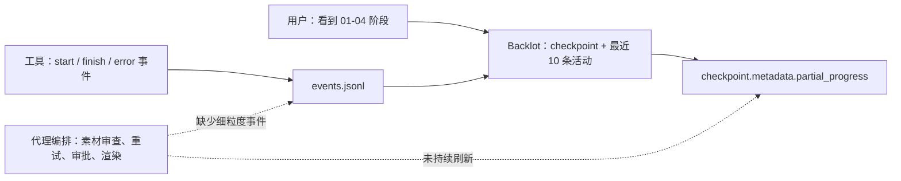

# table-mat-mix-v4: 执行复盘与技术方案评审

**日期：** 2026-08-17
**范围：** `table-mat-mix-v4` 从真实素材探测到本地交付包的实际执行记录。
**证据等级：** 文件、checkpoint、`events.jsonl`、最终 QA 与代码实现为准；没有被遥测记录的等待时间明确标为“不可归因”。

## 1. 结论

本项目的最终本地交付已经完成，不处于“等待最终渲染”状态：

- `renders/final.mp4`：1080x1920、30fps、30.1 秒、H.264 `yuv420p`、AAC；
- `render_report.json`：900 帧 Remotion atelier 成片，最终受控渲染耗时 76.2 秒；
- `final-qa.json`：通过，未发现黑帧、冻结帧、编码、音频或 CTA 安全区问题；
- `final_review.json`：通过，实测 -13.5 LUFS（目标 -14 LUFS），已批准的自有源字幕可见，被拒绝 claim 的抽检未见；
- `checkpoint_publish.json`：`awaiting_human` 仅表示等待是否授权外部发布。本地交付包已完成，未尝试平台上传。

这条片子的创意与交付质量是合格的；效率与可观测性仍不合格。根因不是 900 帧本身，而是 **工具事件、checkpoint 子进度、Backlot 展示和人工审批没有形成一个实时、可恢复的控制回路**。

## 2. 实际时间线与耗时

以下来自项目的 `events.jsonl` 与最终 artifacts，而不是聊天中的估计。

| 时段（UTC） | 实际动作 | 已记录机器耗时 | 用户侧效果 | 结论 |
|---|---|---:|---|---|
| 08-16 04:18–04:19 | 参考与三条源视频场景检测、抽帧、音频能量分析 | 单次 0.12–1.67s | 工作台应显示研究活动 | 工具本身快；随后到 05:33 约 74 分钟没有可归因的子步骤事件，是“看似卡住”的第一处证据。 |
| 05:33–05:35 | TTS selector / Doubao 调用尝试 | 已记录 0.01–0.23s；真实网络等待未完整记录 | 用户经历权限与外网重试 | 事件层只记录包装器，不足以归因 provider 排队、认证或重试。 |
| 08:28–08:41 | 5 次连续 sample compose | 23.86–24.78s/次，合计约 120.86s | 多次完成后才看到版本 | 这是最明确的低效：裁切、蒙版、CTA 与空白帧等局部问题重复触发完整样片窗口。 |
| 08:43–14:18 | Quick QA、策略修订、人工审批与基础设施支线 | Quick QA 0.10–3.33s；其余不可归因 | 用户感知为长期等待 | 机器 QA 很快；时间主要属于人工决策、未记录的代理编排和 `sample-tts` 支线，不可写成渲染慢。 |
| 08-17 02:04–02:07 | 首次 full render | 145.18s | 发生一次长渲染 | 应被记录为明确 attempt、参数和失败/产物关系；当前通用事件缺少这些上下文。 |
| 02:32–02:34 | 交付编码/最终 render | 1.39s + 76.20s | 得到最终成片 | 合理，最终 `render_report` 对应的 76.2 秒是可复现实测。 |
| 02:35–02:40 | 两轮 full QA 与人工抽帧复核 | 2.86s + 2.85s | 质量门通过 | 最终技术质量可信；但人工抽帧仅 4 帧，claim 覆盖仍有自动化空间。 |

### 时间解释原则

1. 不能把“从用户发起到拿到结果”的全部时间归因给视频渲染。当前 logs 证明多数单个本地工具很快。
2. 已记录的 74 分钟空档是监控缺口，不是可证明的“参考分析运行了 74 分钟”。
3. 审批等待、授权重试、上下文恢复、基础设施开发和实际渲染必须分桶；它们需要不同的优化手段。

## 3. 用户路径与后端路径的断点



### 前端现状

- Backlot 的 state 层已经读取 `checkpoint.metadata.partial_progress`，并读取项目 `events.jsonl`。
- Board 已能显示 Activity，也能给生成中的分镜做状态展示；UI 目前只取最近 10 条活动。
- 它没有把 “目前第几帧 / 总帧数、attempt、ETA、等待原因、已耗时、下一次 heartbeat” 建成稳定的界面模型。

### 后端现状

- `BaseTool` 自动写 `start/finish/error` 到 `events.jsonl`；这解决了“工具完全无痕”。
- Pipeline 和 checkpoint 协议已要求 assets/compose 每完成一个单位刷新 `partial_progress`。
- 但本项目的长编排工作与 Remotion 帧级进度没有统一写入；工具 wrapper 的开始/结束事件不能覆盖等待、重试和实际帧进度。

### 立即判断

不是“Backlot 没有进度能力”，而是 **已有的两种进度来源没有被执行层一致生产，也没有被 UI 聚合成用户可理解的状态**。

## 4. 技术方案匹配度

| 方案 | 现有实现与证据 | 结论 | 处理优先级 |
|---|---|---|---|
| 统一事件流 | `lib/events.py`、`tools/base_tool.py` 已记录 start/finish/error；Backlot 读取 `events.jsonl` | **部分匹配**。缺少 run/stage/attempt/heartbeat/progress 标准字段与编排事件。 | P0 |
| checkpoint 子进度 | checkpoint 协议和 `backlot/state.py` 已支持 `metadata.partial_progress` | **部分匹配**。没有强制 compose 按镜头/帧刷新，也没有 UI SLA。 | P0 |
| sample / full / mux-only 路由 | `lib/render_plan.py`、`tools/video/video_compose.py` 已实现，且 `cinematic-fast` 采用该合同 | **匹配**。应保留；补充 still/window 路由。 | P1 |
| 唯一时间线与锁定决策 | `final_props`、`production_lock`、caption policy revision、render plan 已存在 | **匹配**。本项目最终 900 帧、CTA、裁切和 TTS 均可回溯。 | 持续维护 |
| 原子提交与恢复 | `backlot/project_commit.py` 可将 artifact、checkpoint、decision log 在同 generation 提交；有 recovery 测试 | **部分匹配**。artifact 自身先校验，但 checkpoint 校验读取 canonical disk，不能看到同事务内尚未 materialize 的 artifact。 | P0 |
| 质量 QA | `final_qa.py` 已检查解码、profile、黑帧、冻结、响度、caption declaration/safe zone；最终 full QA 通过 | **匹配但有缺口**。safe-zone 通过 layout declaration 推导，不是 OCR 的真实像素识别；source-burned claim 仍依赖抽帧复核；未强制比较 `final_props.durationInFrames=900` 与输出时长。 | P1 |
| 分辨率无关 QA | full 1080p QA 正确；540p quick mode 对 sample profile 有专门分支 | **部分匹配**。应把安全区、窗口、scale 作为显式 normalized 输入，避免 sample 和 full 的隐性差异。 | P1 |
| 自有烧录字幕策略 | `caption_policy_revision` 与 `final_props` 已声明 retain/crop/review；最终保留批准字幕、裁掉 rejected claim | **匹配**。需把 OCR inventory、可见性证据和合成去重变成强制 gate。 | P1 |
| Remotion 运行稳定性 | 已在 M4 Pro 本机成功产出；本项目曾因并发 Chrome 崩溃改为 concurrency 1 | **部分匹配**。没有项目级稳定参数 profile 和帧级 retry。 | P1 |
| TTS operation 账本 | sample-tts CLI 设计、review 与实现支线已存在 | **不应阻塞本项目主线**。当前项目已成功复用 Doubao，基础设施应独立验收后集成。 | P2 |

## 5. 需要立刻升级的 P0 项

### P0-1：定义并接通运行事件合同

新增一个版本化事件 schema，并要求编排器和工具都发出同一结构：

```json
{
  "run_id": "generation-000042",
  "stage": "compose",
  "unit": {"kind": "frame", "current": 315, "total": 900},
  "operation": "remotion_render",
  "status": "running",
  "attempt": 2,
  "started_at": "...",
  "updated_at": "...",
  "message": "concurrency=1; retry after Chrome target closed"
}
```

要求：每 5–10 秒 heartbeat；状态变化立即上报；所有重试有稳定 `attempt_id`；付费调用另标 `cost_reservation_id`。Backlot 以该流显示进度，checkpoint 只保存可恢复的阶段摘要。

**验收：** 任何超过 30 秒的操作，在工作台上都能看到新 heartbeat；超过 60 秒无 heartbeat 显示为“需要关注”，不能静默停留在旧阶段。

### P0-2：让 checkpoint 校验读取 staged view

现状中 `write_artifact_atomic(..., sink=...)` 将 artifact 暂存到 transaction，随后 `write_checkpoint(..., sink=...)` 的 envelope 验证仍从项目磁盘读取。它无法验证同一事务尚未 materialize 的 canonical artifact，因此此前只能“两阶段落盘后再 checkpoint”。

升级为：`ProjectCommitStore` 提供只读 staged overlay；checkpoint prerequisite、artifact envelope hash 与 schema 校验统一先读 overlay，再单次 commit。`descriptor` 不能只是 manifest 字段，必须被 commit 前验证实际消费。

**验收：** 一次 transaction 内 staged `render_plan` + `sample_report` + `checkpoint_sample` 可通过校验并原子提交；故障注入后可恢复且不会看到半套 artifact。

### P0-3：把批准操作变成原子、可见的状态转换

用户批准 `sample-v5` 后，应在同一 generation 内写：approved decision、`checkpoint_sample=completed/human_approved=true`、`checkpoint_compose=in_progress` 和第一条 compose queued event。不能先留在聊天记录，再由后续代理猜测恢复。

**验收：** 点击批准后 2 秒内工作台从“待批准”切到“已批准，等待渲染”，刷新页面和重启代理都不会丢失。

## 6. 应在下一版本完成的 P1 项

### P1-1：局部验证优先的渲染梯度

保留现有 sample/full/mux-only，在前面加入：

1. `still`：目标帧首/中/尾，检查 CTA、裁切、源字幕。
2. `window`：30–90 帧，检查转场、空白帧、运动连续性。
3. `sample`：300–450 帧、0.5 scale，供人工整体审批。
4. `full_render`：仅在前三层通过后执行。

裁切或 CTA 变更不得直接触发 sample/full，除非 change impact 表明跨镜头或时间线改变。此项能直接减少本项目 5 次连续样片式重渲染。

### P1-2：把 source-burned caption inventory 变为 compose 前硬门

`source_media_review` 必须对每段自有源字幕记录：时间区间、OCR、位置、所有权、claim 结果、retain/crop/mask/replace 动作和证据帧。任何 `pending` 或 `rejected` 条目未指定处理动作，禁止 compose。

最终 QA 除 final_props 声明外，需校验：

- source caption action 与每个时间范围的像素/OCR 证据一致；
- source-burned 与 generated overlay 不重叠或语义重复；
- rejected claim 的风险帧覆盖率为 100%。

### P1-3：参数化样片 QA 与稳定 runtime profile

- safe zone 使用 0–1 归一化坐标；QA 输入显式含 `canvas_width/height`、`render_scale`、full-timeline frame range 和 sample window。
- 记录 machine/runtime profile：Chrome 可执行路径、Remotion bundle hash、可靠 concurrency、frame timeout、最近错误分类。
- 已知 `concurrency=4` 崩溃后，同一机器与 bundle 不得盲目再试；采用 concurrency=1 和 per-frame retry。

同时把期望时长和帧数变成 QA 的硬输入。当前项目的 `final_props` 是 900 帧/30.0 秒，而 `ffprobe` 的最终文件是 30.1 秒；这类一帧以内的封装/时间基误差可以允许，但必须由明确阈值判定，而不能因为 `final_qa` 没有期望时长就自动通过。

## 7. P2：不应进入当前关键路径的工作

`sample-tts` 的 idempotent reservation/reconcile/refund 是值得做的平台能力，但它的 null/auto、schema/runtime 一致性、时间区间与恢复测试属于独立系统。它应有独立 branch、契约反例矩阵和发布门，不应在一条已能通过 `doubao-tts` 产出旁白的视频关键路径中并行返工。

## 8. 推荐交付顺序与量化指标

| 顺序 | 工作 | 成功指标 |
|---:|---|---|
| 1 | P0-1 事件合同 + Backlot 进度卡 | 长操作 heartbeat 覆盖率 100%；无更新告警 <60 秒 |
| 2 | P0-3 审批原子转换 | 批准状态恢复正确率 100%；不再依赖聊天记忆 |
| 3 | P0-2 staged view 事务验证 | 同 generation artifact/checkpoint 提交成功；半提交恢复测试通过 |
| 4 | P1-1 still/window 路由 | 局部视觉变更的平均渲染时长下降至少 50% |
| 5 | P1-2 source caption hard gate | rejected claim 风险段 100% 有 action + evidence |
| 6 | P1-3 QA/runtime profile | sample/full QA 假阳性为 0；同类 Chrome 重试次数下降 |

必须额外采集四个维度：主动机器耗时、等待审批时间、重试/返工次数、付费调用次数。它们不能相互替代，否则“长”永远无法被正确归因。

## 9. 与本项目交付的关系

本文件不改变已批准的 C1、Remotion、atelier、Doubao 旁白或最终成片。它的唯一目标是把本次实际暴露的问题转为可验收的工程升级：让下一次用户在同样的长步骤中始终知道系统正在做什么、为什么慢、是否重试、是否会产生费用，以及什么时候需要自己介入。

## 10. 主要证据

- [`events.jsonl`](../../projects/table-mat-mix-v4/events.jsonl)
- [`render_report.json`](../../projects/table-mat-mix-v4/artifacts/render_report.json)
- [`final-qa.json`](../../projects/table-mat-mix-v4/artifacts/final-qa.json)
- [`final_review.json`](../../projects/table-mat-mix-v4/artifacts/final_review.json)
- [`checkpoint_compose.json`](../../projects/table-mat-mix-v4/checkpoint_compose.json)
- [`checkpoint_publish.json`](../../projects/table-mat-mix-v4/checkpoint_publish.json)
- [`lib/events.py`](../../lib/events.py)
- [`backlot/state.py`](../../backlot/state.py)
- [`backlot/project_commit.py`](../../backlot/project_commit.py)
- [`tools/video/final_qa.py`](../../tools/video/final_qa.py)
