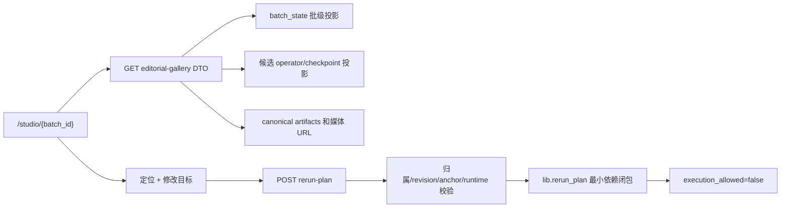

# Editorial Gallery Real Data Integration Implementation Plan

> **For agentic workers:** REQUIRED: Use superpowers:subagent-driven-development (if subagents available) or superpowers:executing-plans to implement this plan. Steps use checkbox (`- [ ]`) syntax for tracking.

**Goal:** 将 `table-mat-batch-001` 及后续批次的真实中间产物接入 Editorial Gallery，使用户能在同一工作室比较候选、查看九阶段证据、定位修改意图并生成只读的最小重跑计划。

**Architecture:** 在 Backlot 同源服务内新增独立的 Editorial Gallery 只读 DTO 和页面入口；服务端复用 `backlot.batch_state`、候选 operator state、canonical artifacts 与 `/media`/`/thumb` 路由，不复制业务判断。首期规划接口只调用 `lib.rerun_plan` 计算依赖闭包，禁止创建 `rerun_run`、写 artifact/checkpoint/decision log 或更新 current pointer。

**Tech Stack:** FastAPI、Python 3、JSON Schema 2020-12、Backlot 原生 JavaScript/CSS、现有媒体路由、`lib.rerun_plan`、pytest、Playwright。

---

## 1. 已确认范围

### 1.1 首期交付

- 从批页或稳定深链 `/studio/<batch-id>` 打开同源 Editorial Gallery。
- 使用真实批级报告、选择状态、候选媒体、九阶段 checkpoint 和中间制品。
- 候选详情可播放 `sample-v2.mp4` / `final.mp4`，并可深链回 `/p/<candidate-id>`。
- 用户通过时间段、镜头、质量维度或失败阶段定位问题，再补充“位置 + 问题 + 目标”。
- 服务端校验候选归属、`child_revision`、定位锚点和已锁定 runtime，返回最小重跑路径与预期；首期 `execution_allowed=false`。
- 静态原型保留显式 fixture 模式，用于视觉回归；真实数据加载失败时显示真实错误，不自动回退为假数据。

### 1.2 明确非目标

- 不在本期执行重跑，不创建 `rerun_run`，不提供 preview/promote/discard。
- 不修改 `table-mat-batch-001` 的既有 artifact、checkpoint、revision、审批或媒体。
- 不回填该历史批缺失的 `candidate_variant_plan`，也不把缺证据显示成“差异通过”。
- 不把 `batch_quality_report.partial`、VLM 未运行或 L1a `revise` 改写为质量通过。
- 不影响普通单视频 `/p/<project-id>` 工作台；新入口只对含 `candidate_batch` 的批项目开放。
- 不新增第二套 orchestrator；未来执行仍复用候选自己的九阶段图和独立 revision。

## 2. 事实源与页面映射

| 页面区域 | 唯一事实源 | 历史批降级语义 |
|---|---|---|
| 批阶段、预算、选择 | `build_batch_review_data()` | 保留当前 aggregate revision 与 warnings |
| 候选九阶段 | 子项目 `checkpoint_*.json` 的 operator 投影 | 缺阶段显示“证据缺失”，不推断完成 |
| 样片与成片 | `board.media.renders` + `/media`/`/thumb` | 优先 `final.mp4`，其次最新 sample |
| 评分与五项确认 | scoped `evaluation_report.sample/final`、sample review | VLM 缺失显示“未运行/数据不完整” |
| 效率/效果报告 | `batch_run_report.json`、`batch_quality_report.json` | 真实呈现 `complete/partial/degraded/missing` |
| 候选差异 | `candidate_variant_plan` + pairwise 投影 | `table-mat-batch-001` 显示“差异证据缺失” |
| 修改定位 | 当前候选 revision 的时间、镜头、finding 引用 | revision 变化后计划 `stale`，要求重新定位 |
| 最小重跑路径 | `lib.rerun_plan` 的依赖规则 | 只返回计划，不写运行事实 |

`table-mat-batch-001` 当前事实应如实显示：5 个候选均可查看，c2/c3 已选入精剪，批运行报告完整，质量报告为部分数据，历史候选无差异计划。

### 2.1 历史 VLM 与质量结论优先级

候选当前 revision 的 scoped `evaluation_report.sample/final` 是“当前质量结论”的唯一来源；只有当其 `creative_advisory.scored=true`、`rubric_version` 与请求快照一致、且 `source_refs`/revision 能匹配时，才投影为当前 VLM 分数。批根 `batch_quality_report` 中的 VLM 数字属于批报告 advisory：若无法与候选当前 revision、scope 和 rubric 同时匹配，只显示为“历史报告 advisory / provenance conflict”，并将质量数据标为 `degraded`，不得合并到候选当前分数或 hard-gate 结论。当前 `L1a=revise` 始终保持 `quality_conclusion=revise`，不能因 c2/c3 已选而变成 pass。

## 3. 页面与数据流



批量工作台负责批级审批、比较和选择；Editorial Gallery 负责选中候选的证据查看与修改规划；候选 `/p/<candidate-id>` 继续是当前单项目事实页。三者共享事实源，不互相复制状态机。

## 4. 接口契约

### 4.1 只读工作室 DTO

`GET /api/v2/projects/{batch_id}/editorial-gallery`

响应必须通过 `schemas/backlot/editorial_gallery.schema.json`，顶层至少包含：

```json
{
  "schema_version": "1.0",
  "batch_id": "table-mat-batch-001",
  "aggregate_revision": "...",
  "snapshot_at": "...",
  "consistency": "stable",
  "batch": {
    "phase": "completed",
    "rail": [],
    "budget": {},
    "selection": {},
    "reports": {},
    "diversity": {}
  },
  "candidates": [],
  "capabilities": {
    "plan_rerun": true,
    "execute_rerun": false
  }
}
```

每个 `candidate` 必须携带：

- `candidate_id`、`project_id`、`label`、`status`、`child_revision`；
- `selected_for_edit`、`quality_conclusion`、最多三个判断层证据标签；
- `media.sample_url/final_url/poster_url/duration_seconds`；
- 固定九阶段 `stages[]`，每阶段含业务标签、状态、更新时间和 `artifacts[]`；
- `evaluation`、`human_confirmations`、`vlm_findings[]`、`audio_tracks[]`；
- `diversity`，缺计划时为 `evidence_status=missing`，不得用零分或 pass 代替；
- `links.operator` 与可用媒体链接；所有路径必须经过项目根 containment 校验。

### 4.2 只读最小重跑规划

`POST /api/v2/projects/{batch_id}/editorial-gallery/rerun-plan`

请求：

```json
{
  "candidate_id": "table-mat-batch-001-c2",
  "aggregate_revision": "...",
  "child_revision": "<opaque-child-revision-hash>",
  "intent": "pacing",
  "anchor": {"type": "time_range", "start_seconds": 0, "end_seconds": 3},
  "instruction": "前 3 秒直接进入产品动作，删掉铺垫",
  "vlm_finding_ids": [],
  "confirmed_scope": {"source": "user"},
  "render_runtime": "remotion"
}
```

响应至少包含：

- `candidate_id`、`base_revision`、一次请求内可追踪的 `plan_id`；
- `from_stage`、`affected_stages`、`preserved_stages`；
- `preview_stop_stage`、`estimated_cost_usd`；
- `expectation`：保留内容、预计改变、预览验收点和主要风险；
- `execution_allowed=false`、`execution_block_reason="planning_only"`。

硬校验与错误映射：

1. `batch_id` 必须是批项目，`candidate_id` 必须属于该批；非批项目/未知候选返回 `404 not_found`。
2. `aggregate_revision` 与 `child_revision` 必须在同一读取快照内匹配，且在调用规划器前后再次复核；任一变化返回 `409 stale`，不得生成似是而非的新计划。
3. 时间锚点必须在 `active_media.duration_seconds` 内；镜头锚点必须能解析到当前 revision 的制品；失败返回 `422 validation_failed`。
4. `render_runtime` 可省略。优先级为 `production_lock.locked_values.render_runtime`，其次 `edit_decisions.render_runtime`；两者冲突返回 `422 validation_failed`，两者缺失返回 `409 runtime_unlocked`。请求显式切换 runtime 首期返回 `422 validation_failed`，不静默切换。
5. 接口不得调用 `create_rerun_run()`，不得写项目目录、operator generation、checkpoint、event、decision log 或 current pointer。

该 POST 使用现有 session 的 `read` 权限并要求 `csrf=True`（规划虽只读，但属于跨站可消耗资源的 POST）；缺少登录/项目权限返回 `401/403`，缺 CSRF 返回 `403`。请求 schema、响应 schema 和错误 envelope 均纳入契约测试。

`lib.rerun_plan` 当前字段 `stages` 在 DTO 边界映射为 `affected_stages`；底层库可保持兼容，schema 不把内部命名泄漏给 UI。

## 5. 文件边界

### 新增

- `schemas/backlot/editorial_gallery.schema.json`：关闭式工作室 DTO、plan request/response 与错误 envelope 契约。
- `backlot/editorial_gallery.py`：跨批/候选的纯只读适配与校验，不含路由和写操作。
- `backlot/ui/editorial-gallery.html`：生产同源页面壳。
- `backlot/ui/editorial-gallery/app.js`：页面状态与渲染。
- `backlot/ui/editorial-gallery/api.js`：真实 adapter；仅显式 `?fixture=1` 加载 fixture adapter。
- `backlot/ui/editorial-gallery/styles.css`：按 Editorial Gallery UI 规范实现。
- `backlot/ui/editorial-gallery/fixture.js`：视觉回归假数据，生产错误不可自动回退到此文件。
- `tests/backlot/test_editorial_gallery.py`：DTO、历史降级和计划纯只读测试。
- `tests/backlot/test_editorial_gallery_ui_contract.py`：结构、文案、可访问性和 adapter 边界测试。
- `tests/fixtures/editorial_gallery/table_mat_batch_001_fixture.json`：可提交的最小五候选磁盘 fixture，包含 `selected c2/c3`、`quality partial`、`diversity missing`、VLM provenance conflict、九阶段和媒体元数据；真实 `projects/table-mat-batch-001` 仅用于本地验收，不作为 CI 输入。
- `tests/backlot/test_editorial_gallery_playwright.py`：启动测试 server 后覆盖 fixture/错误/stale/partial、视频请求、dialog、390px overflow 与 1440/1024/390 截图。

### 修改

- `backlot/operator_routes.py`：增加两个 API 路由；保留现有 `candidate-rerun` 写意图接口供后续阶段使用。
- `backlot/server.py`：增加 `/studio/{batch_id}` 同源页面路由和静态资源 cache busting。
- `backlot/batch_state.py`：只在现有投影缺少必要事实时补充稳定字段，不复制工作室 DTO。
- `schemas/backlot/operator_state.schema.json`：仅在共享 DTO 引用确有必要时更新。
- `design-demos/editorial-gallery/index.html`：保留视觉原型；将硬编码数据责任迁至 fixture adapter 后不再作为生产入口。
- `backlot/state.py`：将 `batch_run_report.json`、`batch_quality_report.json` 纳入 canonical artifact collection；读取只接受 `projects/<batch-id>/artifacts/` 下 canonical 文件，不从 UI 或子项目别名推断。
- `docs/art-plan/Batch_Workbench_Interaction_Design_2026-08-23.md`、`docs/art-plan/Batch_Workbench_Editorial_Gallery_UI_Standards_2026-08-23.md`：同步入口、降级和只读规划边界。

## Chunk 1: 冻结只读契约

### Task 1: Editorial Gallery DTO schema

**Files:** `schemas/backlot/editorial_gallery.schema.json`、`tests/backlot/test_editorial_gallery.py`。

- [ ] **Step 1: 写失败契约测试。** 覆盖完整批次、`partial` 报告、缺差异计划、九阶段缺证据和非法媒体路径。
- [ ] **Step 2: 运行失败测试。** `pytest tests/backlot/test_editorial_gallery.py -q`；预期因 schema/构建器不存在而失败。
- [ ] **Step 3: 实现关闭式 schema。** 除明确可扩展的 artifact metadata 外使用 `additionalProperties: false`；固定业务 enum，不要求前端解释内部 checkpoint 状态。
- [ ] **Step 4: 注册 schema 加载测试。** 验证响应不能出现本机绝对路径、原始 provider 凭证或未知状态。
- [ ] **Step 5: 运行测试并提交。** 预期 DTO contract 全绿。

### Task 2: 只读聚合服务

**Files:** `backlot/editorial_gallery.py`、`backlot/batch_state.py`、`tests/backlot/test_editorial_gallery.py`。

- [ ] **Step 1: 写失败映射测试。** 使用五候选 fixture，断言 c2/c3 选择状态、sample/final 媒体、固定九阶段和报告降级语义。
- [ ] **Step 2: 实现 `build_editorial_gallery(project_dir)`。** 复用 `load_board_state`、`build_batch_review_data` 和 operator 的安全媒体 URL 规则；按白名单读取中间制品摘要。媒体按 artifact ref/hash 选择 `final.mp4`，再按固定 artifact ref 选择 `sample-v2.mp4`，mtime 只作为缺 ref 时的降级，并返回 `active_media.path/hash/revision/duration_seconds`。
- [ ] **Step 3: 加历史兼容。** 无 `candidate_variant_plan` 返回 `evidence_status=missing`；当前 scoped VLM 未运行返回 `status=missing`；批报告 advisory 与当前 revision/scope/rubric 不匹配返回 `provenance_conflict` + `degraded`；任何一种都不伪造评分。固定结论真值表：L1a `pass/revise/fail` 优先于 VLM advisory，技术 QA fail 优先于全部 advisory，selected 只表示选择事实，不改变质量结论。
- [ ] **Step 4: 加快照稳定校验。** 读取前后比较 aggregate/child revision；变化时返回 `consistency=unstable`，页面只读且要求刷新。
- [ ] **Step 5: 验证无写入。** 测试前后比较项目树文件清单、mtime 和内容 hash。
- [ ] **Step 6: 运行 `pytest tests/backlot/test_editorial_gallery.py -q`。** 预期通过。

## Chunk 2: 接入同源页面

### Task 3: API 与页面入口

**Files:** `backlot/operator_routes.py`、`backlot/server.py`、`tests/backlot/test_server.py`、`tests/backlot/test_editorial_gallery.py`。

- [ ] **Step 1: 写 GET/POST 路由失败测试。** GET 覆盖授权、未知项目、非批项目、路径穿越和正常响应 schema；POST 覆盖 `read` 权限、CSRF、非成员候选、aggregate/child stale、runtime_unlocked、validation_failed 和正常只读响应。
- [ ] **Step 2: 实现 `GET .../editorial-gallery`。** 使用现有 `authenticate(..., "read")`，通过 `asyncio.to_thread` 执行文件投影。
- [ ] **Step 3: 实现 `POST .../editorial-gallery/rerun-plan`。** 使用 `authenticate(..., "read", csrf=True)`，在一次请求内完成批/候选快照双读、anchor/media/runtime 校验、前后 revision 复核，再返回关闭式 plan response；任何 stale 使用 HTTP 409。
- [ ] **Step 4: 写 `/studio/{batch_id}` 页面测试。** 未登录遵循现有登录跳转；登录后返回页面并注入版本化静态资源。
- [ ] **Step 5: 实现页面路由。** 页面与 API 保持 4750 同源，复用现有 session/CSRF，不增加 CORS 配置。
- [ ] **Step 6: 运行相关 server/API 测试。** 预期原 `/p` 和媒体 Range 请求零回归。

### Task 4: 将高保真原型拆为真实 adapter

**Files:** `backlot/ui/editorial-gallery.html`、`backlot/ui/editorial-gallery/app.js`、`backlot/ui/editorial-gallery/api.js`、`backlot/ui/editorial-gallery/fixture.js`、`backlot/ui/editorial-gallery/styles.css`、`tests/backlot/test_editorial_gallery_ui_contract.py`。

- [ ] **Step 1: 写 UI contract 失败测试。** 断言真实 API、显式 fixture 开关、加载/空/错误/stale/partial 状态、dialog 语义和无 `undefined` 插值。
- [ ] **Step 2: 拆页面壳与样式。** 保留当前 Editorial Gallery 的视觉层级、画廊、抽屉和 1440/1024/390 断点，不把硬编码业务结论带入生产 bundle。
- [ ] **Step 3: 实现真实 adapter。** 默认读取当前 URL 的 batch id；失败显示错误与重试，不调用 fixture。
- [ ] **Step 4: 实现显式 fixture adapter。** 只有 `?fixture=1` 生效并显示“演示数据”标识。
- [ ] **Step 5: 映射真实候选。** 判断层最多一个结论、三个证据标签；完整九阶段、报告、VLM/人工确认和 artifacts 放证据抽屉。
- [ ] **Step 6: 增加返回入口。** 候选详情提供 `/p/<candidate-id>` 深链，批级动作返回 `/p/<batch-id>`；工作室不复制审批按钮。
- [ ] **Step 7: 运行 `node --check` 与 UI contract 测试。** 预期无语法和结构错误。

## Chunk 3: 只读最小重跑规划

### Task 5: 纯规划服务

**Files:** `backlot/editorial_gallery.py`、`lib/rerun_plan.py`、`tests/backlot/test_editorial_gallery.py`、`tests/lib/test_rerun_plan.py`。

- [ ] **Step 1: 写失败测试。** 覆盖四类 intent、多个 finding 依赖闭包、越界时间锚点、未知镜头、非成员候选、stale revision、runtime 切换和空目标；revision 使用 opaque 64 位 hash，不使用 `rev-N` 语义。
- [ ] **Step 2: 增加纯规划包装器。** 从当前候选事实解析锁定 runtime 与媒体时长，规范化 anchor，再调用 `create_rerun_plan()`。扩展 `lib/rerun_plan.py` 的规则：`opening/time_range -> edit`、`shot_order/pacing -> edit`、`copy/subtitle -> script`、`visual/source_window -> assets`、`technical/failure_stage -> 失败阶段`；多个 finding 取起始阶段最早者，并对阶段列表做有序并集；未知 finding 返回 `422`，不默认为 pacing。
- [ ] **Step 3: 固定计划确定性边界。** `plan_id` 由 `batch_id + candidate_id + aggregate_revision + child_revision + normalized change_set` 的语义哈希派生；`target_revision` 在只读阶段只返回 `draft:<hash>`，不递增或随机生成；成本根据 affected stages 的估算表求和并返回计算依据。
- [ ] **Step 4: 补 `expectation`。** 以结构化字段返回 preserved/changed/preview_acceptance/risks；不承诺未经评估的具体分数提升。
- [ ] **Step 5: 返回显式执行边界。** 固定 `execution_allowed=false`，且测试 monkeypatch `create_rerun_run`/写盘入口为调用即失败。
- [ ] **Step 6: 保持现有 rerun API 兼容。** 不改变 `candidate-rerun` 当前响应，工作室 DTO 在边界映射 `stages -> affected_stages`。
- [ ] **Step 7: 运行 lib 与工作室聚焦测试。** 预期通过。

### Task 6: 规划交互

**Files:** `backlot/ui/editorial-gallery/app.js`、`backlot/ui/editorial-gallery/api.js`、`tests/backlot/test_editorial_gallery_ui_contract.py`。

- [ ] **Step 1: 实现“定位 -> 描述 -> 复述”。** 支持播放器时间段、镜头、质量 finding 与失败阶段入口；自然语言只补目标，不要求用户理解 stage id。
- [ ] **Step 2: 提交前复述范围。** 清晰区分 VLM 建议与用户确认范围；revision 绑定显示在证据层。
- [ ] **Step 3: 呈现计划。** 显示从哪一阶段开始、哪些阶段保留、先看到什么预览、成本估算、预期改变和风险。
- [ ] **Step 4: 禁用执行文案。** 主动作只能是“生成修改计划”或“返回批量工作台”，不得出现可执行的“开始重跑”。
- [ ] **Step 5: stale 时保留输入。** 刷新候选事实后要求用户重新确认定位，不静默套用旧 anchor。

## Chunk 4: 验收与文档同步

### Task 7: 真实批验收

**Files:** 新增 `docs/art-plan/Table_Mat_Batch_001_Editorial_Gallery_Acceptance_2026-08-24.md`；更新本计划状态。

- [ ] **Step 1: 启动 Backlot 测试实例。** 使用现有本地认证和 `OPENMONTAGE_PROJECTS_DIR`，不复制真实项目。
- [ ] **Step 2: 验证真实 DTO。** 记录 5 个候选、c2/c3 选择、九阶段、媒体 URL、run complete、quality partial、diversity missing。
- [ ] **Step 3: 验证四类计划。** 对 pacing/copy/visual/technical 各生成一次只读计划，确认项目树 hash 不变。
- [ ] **Step 4: Playwright 三档截图。** 运行 `pytest tests/backlot/test_editorial_gallery_playwright.py -q`；使用 fixture server 在 1440px、1024px、390px 检查视频请求成功、抽屉不溢出、文本不遮挡、移动端无页面横向滚动，并输出截图文件。
- [ ] **Step 5: 记录浏览器证据。** 保存截图路径、API 状态、已知降级和未开放能力。

### Task 8: 回归与发布门

- [ ] **Step 1: 运行聚焦回归。**

```bash
pytest tests/backlot/test_editorial_gallery.py \
  tests/backlot/test_editorial_gallery_ui_contract.py \
  tests/backlot/test_editorial_gallery_playwright.py \
  tests/backlot/test_operator_state.py \
  tests/backlot/test_operator_state_schema.py \
  tests/backlot/test_batch_workbench.py \
  tests/backlot/test_server.py \
  tests/lib/test_candidate_batch.py \
  tests/lib/test_rerun_plan.py -q
```

- [ ] **Step 2: 运行 JavaScript 语法检查。** `node --check backlot/ui/editorial-gallery/app.js && node --check backlot/ui/editorial-gallery/api.js`。
- [ ] **Step 2a: 只读副作用检查。** monkeypatch canonical artifact writers、`ProjectCommitStore`、checkpoint/event emitters、provider/tool calls 和 `create_rerun_run` 为失败；允许 `/thumb` 只写 `.backlot/thumbs` 缓存，但 batch/child production state、current pointer、operator store 和事件文件必须 hash/mtime 不变。
- [ ] **Step 3: 运行全量回归。** 结果写入验收记录，不沿用旧基线数字冒充本次结果。
- [ ] **Step 4: 发布门。** 只有只读性、路径安全、历史降级、三档视觉和单视频零回归全部通过，才在批页开放“进入编辑工作室”。
- [ ] **Step 5: 分开提交。** 先 DTO/API，再 UI adapter，再只读规划和验收文档；每次提交包含对应聚焦测试结果。

## 6. 后续阶段，不属于本计划

真正执行重跑前，必须另立计划完成：持久化 `rerun_run`、preview 低成本运行、预览确认、完整运行、promote/discard、并发/预算治理、checkpoint/decision log 原子提交、取消与故障恢复。届时执行仍发生在候选自己的九阶段内，只运行最小子图；旧 revision 在 promote 前始终保持 current。
